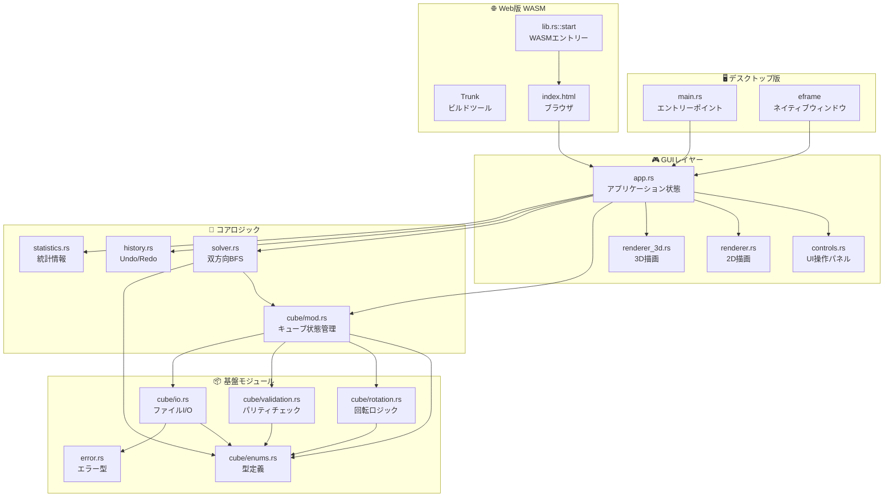
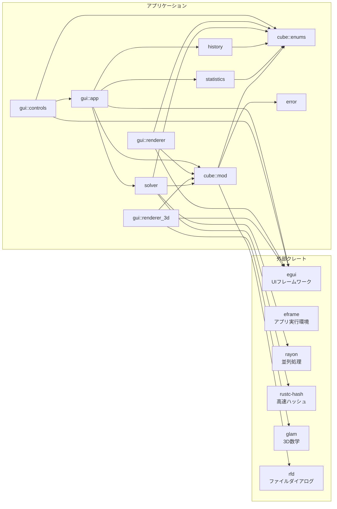
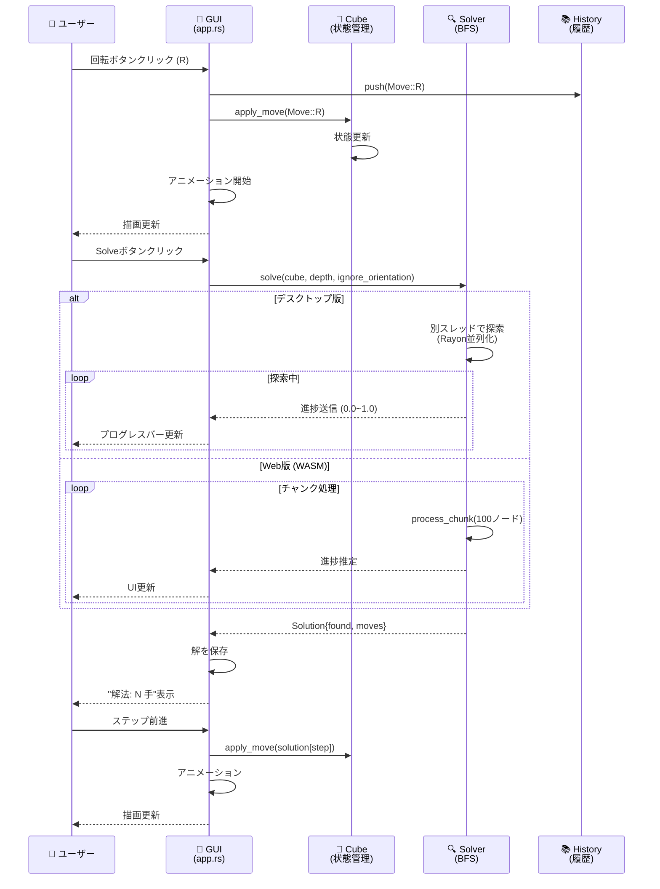
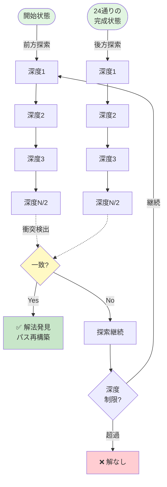

# 2x2 ルービックキューブ

Rustで実装した2x2ルービックキューブのGUIプログラムです。超高速な双方向BFSソルバー機能を搭載しています。

[](https://katoy.github.io/rust-r-cube/)


## スクリーンショット

### メイン画面


初期状態のキューブと操作パネル。3Dビューで直感的に操作できます。

## 特徴

- 🎮 **インタラクティブなGUI**: モダンで使い勝手の良いインターフェース
- 🚀 **並列化による超高速探索**: `Rayon` を活用したマルチスレッド双方向BFSにより、最短解を瞬時に探索
- 📊 **リアルタイム進捗表示**: 解法探索中の進捗をプログレスバーで可視化
- 🎯 **解決モードの切り替え**: 「色のみを揃える」か「矢印の向きまで完璧に揃える」かを自由に選択可能
- 📸 **6面スキャン入力**: 実物のルービックキューブの状態を視覚的に入力できる機能
- 💾 **状態の永続化**: スキャン途中の未設定状態（Gray）を含め、ファイルへの保存・読み込みが可能
- ✨ **ダイナミックな2Dアニメーション**: 影(Drop Shadow)、浮き上がり(Lift)、円弧移動(Arc Movement)などの視覚効果
- 🔄 **向きの自動復元**: ファイル読み込み時、色配置から物理的に正しい向きを自動的に復元
- 🔄 **向きの可視化**: 各ステッカーに矢印マークを表示し、ステッカー自体の向きを視覚化
- 🛡️ **物理的な整合性保証**: コーナーパズルの物理法則に基づく厳密な整合性チェックを導入
- ⚙️ **高度な制御**: アニメーション速度調整、回転中の面全体の強調表示、ステップごとの解法操作

## 必要要件

### [要件] デスクトップ版

- Rust 1.70以上

### [要件] Web版

- Rust 1.70以上
- wasm32-unknown-unknownターゲット: `rustup target add wasm32-unknown-unknown`
- Trunk: `cargo install trunk`

## ビルドと実行

### [手順] デスクトップ版

```bash
# リリースビルド
cargo build --release

# 実行
cargo run --release
```

### [手順] Web版

**🌐 オンラインデモ:** [https://katoy.github.io/rust-r-cube/](https://katoy.github.io/rust-r-cube/)

ブラウザから直接アクセスして、インストール不要で利用できます。

**ローカル開発:**

```bash
# 開発サーバーで起動（自動でブラウザが開きます）
trunk serve --open

# リリースビルド（静的ファイルをdist/に生成）
trunk build --release
```

Web版は`dist/`フォルダに生成されます。Webサーバーで公開する場合は、このフォルダをデプロイしてください。

> [!NOTE]
>
> - 保存: ブラウザのダウンロード機能を使用
> - 読み込み: 現時点ではテキストを直接入力する形式になります（今後改善予定）

## 使い方

### 基本操作

- **スクランブル**: キューブをランダムに5〜10手混ぜます
- **リセット**: キューブを初期状態（完成状態）に戻します
- **解決設定**:
  - **向き無視**: 各面の色さえ揃えば完成とみなします (最大深度: 11)
  - **向きも揃える**: 色に加えて、ステッカーの矢印まで全て初期状態に揃えます (最大深度: 11)

> [!NOTE]
> **2x2キューブにおける色と向きの関係**
> 2x2キューブでは、すべての面の色が揃っている状態（`is_solved`）であれば、理論的・物理的にステッカーの向き（矢印）も必ず初期状態に揃います。
> 本アプリに搭載されている「向き（矢印）」の管理機能は、将来的な **3x3x3ルービックキューブへの拡張**（センターパーツの回転により、色は揃っているが向きが揃っていない状態が発生する）を見据えた準備実装です。

- **解法を探す**: 現在の状態から最短解を探索します（進捗バーで進行状況を確認できます）

### 6面スキャン入力

実際のルービックキューブの状態をアプリに入力する機能です。実物のキューブを見ながら、各面の色を手動で設定できます。

1. **📸 6面スキャン入力** ボタンをクリック
2. 各面（上→右→前→下→左→後）の順に4つのステッカーの色をクリックして選択
3. 画面上のカラーパレットから対応する色を選択
4. 全6面（24ステッカー）の入力が完了したら **✓ 完了** をクリック
5. 入力を中断したい場合は **✗ キャンセル** をクリック

> **ヒント**: 各面の入力順序は、画面の指示に従ってください。入力中の面がハイライトされます。

### ファイルの読み込み/保存

現在のキューブの状態を保存したり、以前の状態を読み込んだりできます。OS標準のダイアログ（ファイル選択画面）が開くため、任意のフォルダやファイル名を指定できます。

- **💾 保存**: 現在のキューブの状態をテキストファイルに書き出します
- **📂 読込**: 保存したファイルを選択して読み込みます（読み込み後、バックグラウンドで自動的に正しい向きに補正されます）

ファイルフォーマットは以下の形式です：

```text
     WWWW
GGGG RRRR BBBB OOOO
     YYYY
```

各文字は色を表します（W=白、Y=黄、R=赤、O=オレンジ、B=青、G=緑）。
また、`.` は **Gray (未設定)** を表し、スキャン入力途中の状態を保存・復元する際に使用されます。

各面の4つのステッカーは、**左上→右上→左下→右下**の順で記載します。例えば、面の色配置が以下の場合：

```text
白 橙
黄 緑
```

ファイルには `WOYG` と記載します。この形式で手動編集も可能です。

#### サンプルファイル

プロジェクトには、様々な状態のサンプルファイルが `cubes/` ディレクトリに含まれています：

- [cube_normal.txt](file:///Users/katoy/github/study-rust/rust-r-cube/2x2-web/cubes/cube_normal.txt) - 完成状態
- [cube_god.txt](file:///Users/katoy/github/study-rust/rust-r-cube/2x2-web/cubes/cube_god.txt) - 11手必要な最難関状態（God's Number）
- [cube_god2.txt](file:///Users/katoy/github/study-rust/rust-r-cube/2x2-web/cubes/cube_god2.txt) - 別の11手状態
- [cube_ex001.txt](file:///Users/katoy/github/study-rust/rust-r-cube/2x2-web/cubes/cube_ex001.txt) - サンプル状態
- [cube_diff2.txt](file:///Users/katoy/github/study-rust/rust-r-cube/2x2-web/cubes/cube_diff2.txt) - サンプル状態
- [cube_normalwy.txt](file:///Users/katoy/github/study-rust/rust-r-cube/2x2-web/cubes/cube_normalwy.txt) - サンプル状態

これらのファイルを読み込んで、実際のキューブ状態を試すことができます。

### 回転操作

キューブの各面を回転させる操作です。ボタンをクリックすると、対応する面が90度回転します。

#### 基本操作（時計回り）

- **R** (Right): 右面を時計回りに90度回転
- **L** (Left): 左面を時計回りに90度回転
- **U** (Up): 上面を時計回りに90度回転
- **D** (Down): 下面を時計回りに90度回転
- **F** (Front): 前面を時計回りに90度回転
- **B** (Back): 背面を時計回りに90度回転

#### 逆回転操作（反時計回り）

各操作に `'` (プライム) を付けると、反時計回りに90度回転します：

- **R'** (R-prime): 右面を反時計回りに90度回転
- **L'** (L-prime): 左面を反時計回りに90度回転
- **U'** (U-prime): 上面を反時計回りに90度回転
- **D'** (D-prime): 下面を反時計回りに90度回転
- **F'** (F-prime): 前面を反時計回りに90度回転
- **B'** (B-prime): 背面を反時計回りに90度回転

> **ヒント**: 任意の操作を4回繰り返すと元の状態に戻ります（例: R → R → R → R = 元の状態）

### 神の数 (God's Number)

2x2x2ルービックキューブは、どのような状態からでも最大 **11手** で解けることが数学的に証明されています。これは、180度回転（R2, U2等）を1手として数える **HTM (Half Turn Metric)** という基準に基づいています。

本ツールは HTM に対応しており、ソルバーは常に最短手数（最大11手）の解法を探索します。

> [!NOTE]
> 90度回転のみを1手とし、180度回転を2手と数える基準を **QTM (Quarter Turn Metric)** と呼びます。QTMにおける2x2x2キューブの神の数は **14手** です。

#### 難易度の例 (HTM基準)

- **最遠状態 (11手)**:
  - スクランブル: `F U' F2 R' U R2 U' R' F U' F'` (一例)
  - 状態: `WGWG / GRWY BYBR ROBO YOBG / OYRW` ([cube_god.txt](file:///Users/katoy/github/study-rust/rust-r-cube/2x2/cubes/cube_god.txt))
- **非常に難しい状態 (10手)**:
  - 状態: `WWWW / OOOO GGGR RRBG BBRB / YYYY`
  - 解法: `R2 B D' R' F2 R2 U' R' F R'`

#### R U パターンの周期性

`R U`（右面回転 → 上面回転）を繰り返すと、105回（計210個の90度回転）で元の状態に戻ります。詳細は `tests/cube_tests.rs` の `test_ru_cycle` を参照してください。

本プロジェクトのテストは、論理的なカテゴリに統合・整理されています：

- `tests/cube_tests.rs`: 基本操作、周期性、コーナー整合性。
- `tests/solver_tests.rs`: 探索アルゴリズム、深度制限、プログレス。
- `tests/file_io_tests.rs`: 保存・読み込みの整合性、パース。
- `tests/orientation_tests.rs`: 物理回転、方位不変モデルの検証。
- `tests/end_to_end_tests.rs`: 実機再現、神の数、ユーザー指定状態。
- `tests/workflow_tests.rs`: ファイル操作から解決までの一連の流れ。
- `tests/coverage_tests.rs`: 異常系、エッジケース（ライブラリ内テストと連携）。
- `tests/regression_tests.rs`: 過去の不具合の再発防止。
- `tests/wasm_tests.rs`: WebAssembly環境での動作検証。
- `tests/web_ui_tests.rs`: ブラウザ上でのUI操作・タイミングテスト。

```bash
# 全テストを実行
cargo test --release

# 11手必要な状態を探索（end_to_end_tests内）
cargo test test_difficult_patterns_god_number --release -- --nocapture
```

### 解法ステップ操作

解法が見つかると、一歩ずつ進めたり戻したりできるコントローラーが表示されます。

```text
```

## アーキテクチャ

### システム全体の構成



### モジュール依存関係



### データフロー図



### 探索アルゴリズム（双方向BFS）



## 技術詳細

### 最適化されたソルバー

#### アルゴリズム

- **双方向BFS**: 開始状態と目標状態（24通りの完成状態）の両方から同時に探索することで、探索空間を劇的に削減。
- **時間計算量**: O(b^(d/2)) - 単方向BFSのO(b^d)と比較して大幅に高速

#### パフォーマンス最適化

- **FxHash**: `rustc-hash` (FxHashMap) を採用し、ハッシュマップの操作を高速化
- **Rayon による並列化**: 各探索層の展開をマルチスレッドで実行。8コア環境において探索時間を約90%削減
- **容量事前確保**: HashMapとVecDequeの容量を事前に確保し、再ハッシュのコストを削減
- **Entry API**: 無駄な二重検索を避け、効率的なHashMap更新を実現
- **メモリアロケーションの最小化**: キューブの clone を必要最小限に抑え、GC圧力を軽減
- **進捗送信最適化**: チャネル送信のオーバーヘッドを削減するためのメッセージバッチ化

#### メモリ最適化

- **親への参照のみ保持**: 各探索ノードで操作履歴を保持せず、「親への参照」のみを保持
- **完成状態のキャッシュ**: `OnceLock` を使用し、全24通りの解決済み状態を一度だけ計算して再利用

### カバレッジと品質

- **テスト網羅率**: コアロジック（`src/cube/`）において、**100%** のコードカバレッジを達成しています。

| File                     | Regions | Functions |  Lines  |
| :----------------------- | :-----: | :-------: | :-----: |
| `src/cube/enums.rs`      | 99.05%  |  100.00%  | 99.08%  |
| `src/cube/io.rs`         | 97.48%  |  100.00%  | 99.04%  |
| `src/cube/mod.rs`        | 98.91%  |  100.00%  | 100.00% |
| `src/cube/rotation.rs`   | 100.00% |  100.00%  | 100.00% |
| `src/cube/validation.rs` | 98.26%  |  100.00%  | 96.88%  |
| `src/solver/mod.rs`      | 98.31%  |  100.00%  | 98.64%  |
| `src/solver/coord.rs`    | 99.22%  |  100.00%  | 98.75%  |
| `src/solver/search.rs`   | 100.00% |  100.00%  | 100.00% |
| `src/solver/tables.rs`   | 98.46%  |  100.00%  | 97.67%  |
| `src/history.rs`         | 100.00% |  100.00%  | 100.00% |
| `src/statistics.rs`      | 100.00% |  100.00%  | 100.00% |

- **物理的整合性の保証**: 8つのコーナーピースがそれぞれ正しい3色の組み合わせを維持しているかを常に検証するテストスイート (`check_corner_integrity`) を導入済み。
- **堅牢な回転ロジック**: ユーザー報告に基づくバグ修正を経て、ランダムなスクランブルに対しても整合性を保ち続けることを100回の連続試行テストで実証済み。
- **向き対応ソルバー**: 色だけでなくステッカーの向き（矢印）まで考慮した探索論理を実装。解なしの場合の挙動も含めて完全テスト済み。

### コード品質

- **Clippy 警告ゼロ**: `cargo clippy` で警告が出ないクリーンなコード
- **`#[must_use]` 属性**: 戻り値を持つ重要なメソッドに `#[must_use]` 属性を付与し、値の使い忘れを防止
- **充実したドキュメント**: 全ての公開APIに Rustdoc コメントを記述
- **包括的なテストスイート**: 約100件のテストで機能を網羅的に検証

## ライセンス

MIT License

## 開発・検証

```bash
# 開発ビルド
cargo build

# テスト実行
cargo test

# WASMブラウザテスト
# wasm-packが必要です
cargo install wasm-pack

# Firefoxでテスト（推奨）
wasm-pack test --headless --firefox

# Chromeでテスト
wasm-pack test --headless --chrome

> [!NOTE]
> **WASMテストに関する注意**
> - `wasm-pack`がPATHに含まれていることを確認してください
> - Firefoxまたは Chrome/Chromium がシステムにインストールされている必要があります
> - ChromeDriverやGeckoDriverが自動的にダウンロードされます
> - テスト実行時にブラウザが一時的に起動します（headlessモード）

```bash
# コードカバレッジのリポート生成
cargo llvm-cov --html

# Clippy（静的解析）
cargo clippy -- -D warnings

# フォーマットチェック
cargo fmt -- --check
```

### テストとカバレッジ計測の手順

高速化の成果を確認したり、最新のカバレッジを計測したりする場合は以下のコマンドを使用してください：

```bash
# 全テストを実行
cargo test --release

# カバレッジのサマリーを表示
cargo llvm-cov --summary-only

# クリーンアップと自動整形
cargo clippy && cargo fmt
```

### ベンチマーク

プロジェクトには包括的なベンチマークスイートが含まれており、ソルバーのパフォーマンスを測定できます。

#### ローカルでのベンチマーク実行

```bash
# 全ベンチマークを実行
cargo bench

# 特定のベンチマークのみ実行
cargo bench solver_scramble_5

# ベンチマークのコンパイルのみ確認
cargo bench --no-run
```

#### ベンチマークの内容

現在のベンチマークスイート ([benches/solver_benchmarks.rs](file:///Users/katoy/github/study-rust/rust-r-cube/2x2-web/benches/solver_benchmarks.rs)) には以下が含まれます:

**ソルバー性能:**

- `solver_scramble_3` - 簡単 (3手スクランブル)
- `solver_scramble_5` - 中程度 (5手スクランブル)
- `solver_scramble_8` - 難しい (8手スクランブル)
- `solver_scramble_10` - God Number付近 (10手スクランブル)
- `solver_with_orientation` / `solver_ignore_orientation` - 向き考慮/無視の比較

**基本操作:**

- `cube_apply_move` - 単一操作の適用速度
- `cube_scramble_100` - 100手のスクランブル
- `cube_clone` - クローン操作のコスト

**その他:**

- `cube_hash` - ハッシュ計算のパフォーマンス
- `cube_normalized` - 正規化処理
- `cube_to_file_format` - ファイルI/O

#### CI統合

ベンチマークは以下の形でCI/CDパイプラインに統合されています:

1. **定期実行**: 毎週月曜日 午前2時(UTC) に自動実行
2. **手動実行**: GitHub ActionsのUIから任意のタイミングで実行可能
3. **自動実行**: `main`ブランチへのプッシュ時（`src/**`, `benches/**`, `Cargo.toml`/`Cargo.lock`の変更時）

**結果の確認:**

- [Actions](https://github.com/katoy/rust-r-cube/actions/workflows/benchmark.yml) タブから「Benchmark」ワークフローを選択
- 各実行の詳細ページでStep Summaryに結果が表示されます
- Artifactsから詳細なベンチマーク結果（Criterion出力含む）をダウンロード可能（90日間保持）

> [!TIP]
> ベンチマーク結果は前回実行との比較機能が組み込まれており、パフォーマンスの変化を追跡できます。

