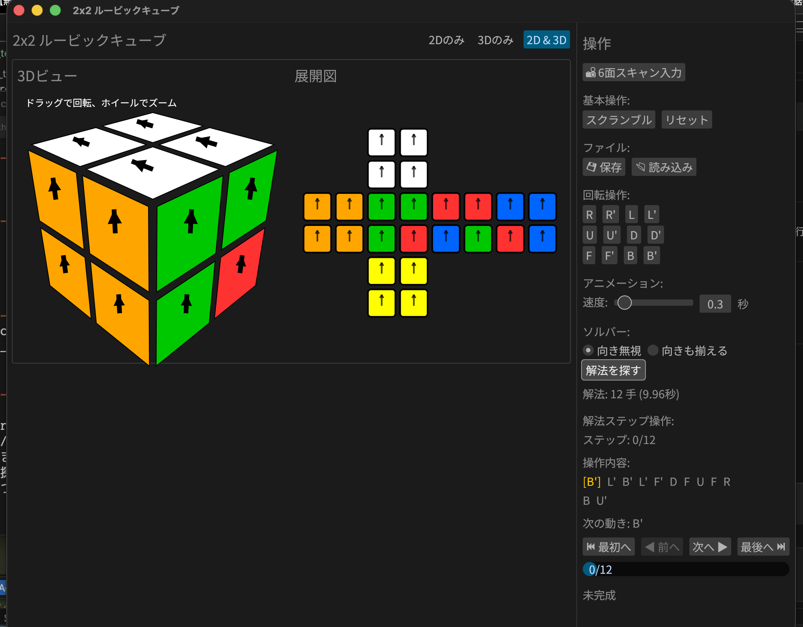
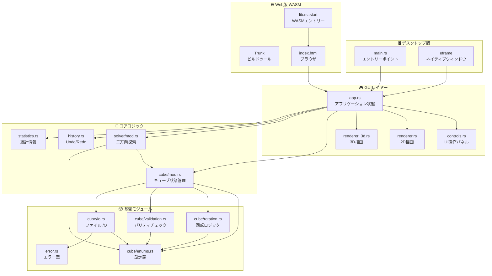
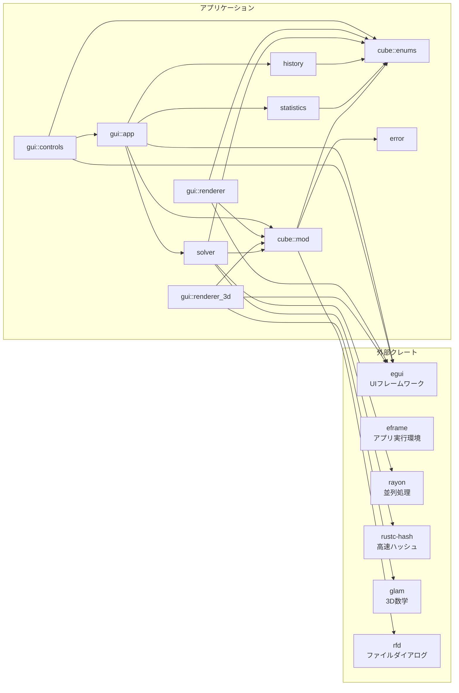

# 2x2 ルービックキューブ

Rustで実装した2x2ルービックキューブのGUIプログラムです。超高速な双方向BFSソルバー機能を搭載しています。

[](https://katoy.github.io/rust-r-cube/)


## スクリーンショット

### メイン画面



初期状態のキューブと操作パネル。3Dビューで直感的に操作できます。

## 特徴

- 🎮 **インタラクティブなGUI**: モダンで使い勝手の良いインターフェース
- 🚀 **並列化による超高速探索**: `Rayon` を活用したマルチスレッド双方向BFSにより、最短解を瞬時に探索
- 📊 **リアルタイム進捗表示**: 解法探索中の進捗をプログレスバーで可視化
- 🎯 **解決モードの切り替え**: 「色のみを揃える」か「矢印の向きまで完璧に揃える」かを自由に選択可能
- 📸 **6面スキャン入力**: 実物のルービックキューブの状態を視覚的に入力できる機能
- 💾 **状態の永続化**: スキャン途中の未設定状態（Gray）を含め、ファイルへの保存・読み込みが可能
- ✨ **ダイナミックな2Dアニメーション**: 影(Drop Shadow)、浮き上がり(Lift)、円弧移動(Arc Movement)などの視覚効果
- ️ **物理的な整合性保証**: コーナーパズルの物理法則に基づく厳密な整合性チェックを導入
- ⚙️ **高度な制御**: アニメーション速度調整、回転中の面全体の強調表示、ステップごとの解法操作

## 必要要件

### [要件] デスクトップ版

- Rust 1.70以上

### [要件] Web版

- Rust 1.70以上
- wasm32-unknown-unknownターゲット: `rustup target add wasm32-unknown-unknown`
- Trunk: `cargo install trunk`

## ビルドと実行

### [手順] デスクトップ版

```bash
# リリースビルド
cargo build --release

# 実行
cargo run --release
```

### [手順] Web版

**🌐 オンラインデモ:** [https://katoy.github.io/rust-r-cube/](https://katoy.github.io/rust-r-cube/)

**ローカル開発:**

```bash
# 開発サーバーで起動（自動でブラウザが開きます）
trunk serve --open

# リリースビルド（静的ファイルをdist/に生成）
trunk build --release
```

## 使い方

### 基本操作

- **スクランブル**: キューブをランダムに5〜10手混ぜます
- **リセット**: キューブを初期状態（完成状態）に戻します
- **解决設定**:
  - **向き無視**: 各面の色さえ揃えば完成とみなします (最大深度: 11)
  - **向きも揃える**: 色に加えて、ステッカーの矢印まで全て初期状態に揃えます (最大深度: 11)

- **解法を探す**: 現在の状態から最短解を探索します

### 6面スキャン入力

実際のルービックキューブの状態をアプリに入力する機能です。

1. **📸 6面スキャン入力** ボタンをクリック
2. 各面（上→右→前→下→左→後）の順にステッカーの色をクリックして選択
3. 全6面の入力が完了したら **✓ 完了** をクリック

### ファイルの読み込み/保存

- **💾 保存**: 現在のキューブの状態をテキストファイルに書き出します
- **📂 読込**: 保存したファイルを選択して読み込みます

#### サンプルファイル
プロジェクトには、様々な状態のサンプルファイルが `cubes/` ディレクトリに含まれています：
- [cube_god.txt](file:///Users/katoy/github/study-rust/rust-r-cube/2x2-web/cubes/cube_god.txt) - 11手必要な最難関状態

### 神の数 (God's Number)

2x2x2ルービックキューブは HTM (Half Turn Metric) 基準で最大 **11手** で解けることが証明されています。本ツールは最短手数の解法を探索します。

### 解法ステップ操作

解法が見つかると、一歩ずつ進めたり戻したりできるコントローラーが表示されます。

## アーキテクチャ

### システム全体の構成



### モジュール依存関係



## 技術詳細

### 最適化されたソルバー

#### アルゴリズム
- **双方向BFS**: 開始状態と目標状態（24通りの完成状態）の両方から同時に探索することで、探索空間を劇的に削減。
- **時間計算量**: O(b^(d/2)) - 単方向BFSのO(b^d)と比較して大幅に高速です。

#### パフォーマンス最適化
- **Rayon による並列化**: 各探索層の展開をマルチスレッドで実行。8コア環境において探索時間を大幅に削減。
- **FxHash**: `rustc-hash` (FxHashMap) を採用し、ハッシュマップの操作を高速化。
- **容量事前確保**: HashMapとVecDequeの容量を事前に確保し、再ハッシュのコストを削減。
- **メモリアロケーションの最小化**: キューブの clone を必要最小限に抑え、GC圧力を軽減。
- **完成状態のキャッシュ**: `OnceLock` を使用し、全24通りの解決済み状態を一度だけ計算して再利用。
- **進捗送信最適化**: チャネル送信のオーバーヘッドを削減するためのメッセージバッチ化。

## 開発・検証

### 開発用コマンド

```bash
# フォーマットチェック
cargo fmt -- --check

# Clippy（静的解析）
cargo clippy -- -D warnings

# WASMブラウザテスト (Firefox推奨)
wasm-pack test --headless --firefox
```

### テストとカバレッジ

本プロジェクトは `src/` からテストを完全に分離し、`tests/` ディレクトリに機能ごとに整理されています。

```bash
# 全テストを実行
cargo test --release

# コードカバレッジのリポート生成
cargo llvm-cov --html --ignore-filename-regex "gui|bin"

# サマリーのみ表示
cargo llvm-cov --summary-only --ignore-filename-regex "gui|bin"
```

#### テストカテゴリ
- `tests/cube_tests.rs`: 基本操作、回転ロジック
- `tests/solver_tests.rs`: 探索アルゴリズム、インクリメンタル状態、ノード制限
- `tests/validation_tests.rs`: 物理的整合性、パリティ
- `tests/io_tests.rs`: ファイル・テキスト形式の入出力
- `tests/history_tests.rs`: 操作履歴、Undo/Redo
- `tests/statistics_tests.rs`: 統計情報の記録・計算
- `tests/workflow_tests.rs`: エンドツーエンドのワークフロー
- `tests/wasm_tests.rs`: WASM環境動作検証

#### コードカバレッジ状況
コアロジックにおいて **99.49%** のラインカバレッジを達成しています。

| モジュール              | 行カバレッジ |
| :---------------------- | :----------- |
| **全体 (コアロジック)** | **99.49%**   |
| `cube/enums.rs`         | 100.00%      |
| `cube/io.rs`            | 100.00%      |
| `cube/mod.rs`           | 100.00%      |
| `cube/rotation.rs`      | 100.00%      |
| `history.rs`            | 100.00%      |
| `statistics.rs`         | 100.00%      |
| `solver/coord.rs`       | 100.00%      |
| `solver/search.rs`      | 100.00%      |
| `cube/validation.rs`    | 99.23%       |
| `solver/mod.rs`         | 98.48%       |
| `solver/tables.rs`      | 97.78%       |

### ベンチマーク

ソルバーのパフォーマンスを測定するためのベンチマークスイートが含まれています。

```bash
# 全ベンチマークを実行
cargo bench

# 特定のベンチマークのみ実行
cargo bench solver_scramble_10
```

#### 内容
- `solver_scramble_*`: 指定手数のスクランブル状態の探索速度
- `cube_*`: 基本操作、クローン、ハッシュ等のコスト
- `solver_with_orientation` / `ignore_orientation`: 向き考慮の有無による比較

## ライセンス

MIT License
