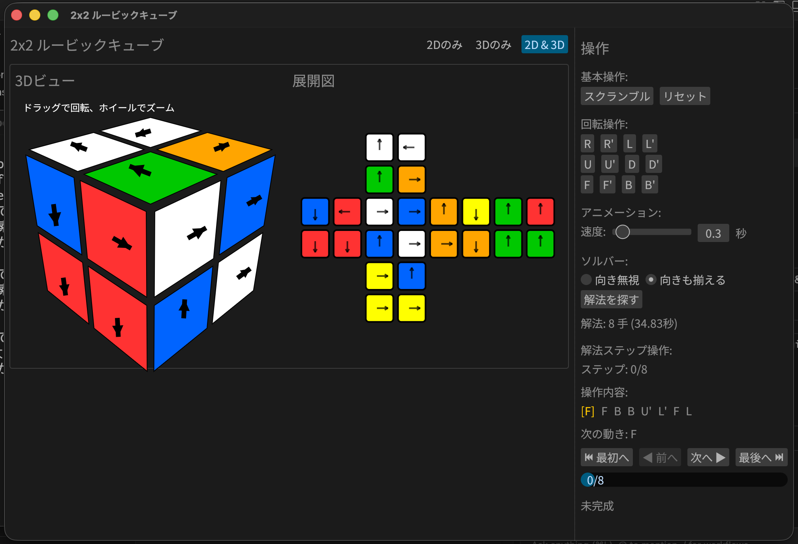

# 2x2 ルービックキューブ

Rustで実装した2x2ルービックキューブのGUIプログラムです。超高速な双方向BFSソルバー機能を搭載しています。


## スクリーンショット

### メイン画面



初期状態のキューブと操作パネル。3Dビューで直感的に操作できます。

## 特徴

- 🎮 **インタラクティブなGUI**: モダンで使い勝手の良いインターフェース
- 🚀 **超高速最短解ソルバー**: 双方向BFSと最適化されたデータ構造により、最短解を瞬時に探索
- 📊 **リアルタイム進捗表示**: 解法探索中の進捗をプログレスバーで可視化
- 🎯 **解決モードの切り替え**: 「色のみを揃える」か「矢印の向きまで完璧に揃える」かを自由に選択可能
- 📸 **6面スキャン入力**: 実物のルービックキューブの状態を視覚的に入力できる機能
- 💾 **ファイル保存/読込**: キューブの状態をファイルに保存・読み込み可能（テキスト形式で手動編集も可）
- ✨ **スムーズなアニメーション**: イージング関数を使用した滑らかな回転移動
- 🔄 **向きの自動復元**: ファイル読み込み時、色配置から物理的に正しい向きを自動的かつ非同期に復元
- 🔄 **向きの可視化**: 各ステッカーに矢印マークを表示し、ステッカー自体の向きを視覚化
- 🛡️ **物理的な整合性保証**: コーナーパズルの物理法則に基づく厳密な整合性チェックを導入
- ⚙️ **アニメーション制御**: 速度調整、再生/一時停止、ステップごとの操作

## 必要要件

- Rust 1.70以上

## ビルドと実行

```bash
# リリースビルド
cargo build --release

# 実行
cargo run --release
```

## 使い方

### 基本操作

- **スクランブル**: キューブをランダムに5〜10手混ぜます
- **リセット**: キューブを初期状態（完成状態）に戻します
- **解決設定**:
  - **向き無視**: 各面の色さえ揃えば完成とみなします (最大深度: 11)
  - **向きも揃える**: 色に加えて、ステッカーの矢印まで全て初期状態に揃えます (最大深度: 14)
- **解法を探す**: 現在の状態から最短解を探索します（進捗バーで進行状況を確認できます）

### 6面スキャン入力

実際のルービックキューブの状態をアプリに入力する機能です。実物のキューブを見ながら、各面の色を手動で設定できます。

1. **📸 6面スキャン入力** ボタンをクリック
2. 各面（上→右→前→下→左→後）の順に4つのステッカーの色をクリックして選択
3. 画面上のカラーパレットから対応する色を選択
4. 全6面（24ステッカー）の入力が完了したら **✓ 完了** をクリック
5. 入力を中断したい場合は **✗ キャンセル** をクリック

> **ヒント**: 各面の入力順序は、画面の指示に従ってください。入力中の面がハイライトされます。

### ファイルの読み込み/保存

キューブの現在の状態をファイルに保存したり、以前保存した状態を読み込むことができます。

- **💾 保存**: 現在のキューブの状態を `cube_state.txt` に保存します
- **📂 読込**: `cube_state.txt` からキューブの状態を読み込みます（読み込み後、バックグラウンドで自動的に正しい向きに補正されます）

ファイルフォーマットは以下の形式です：

```text
     WWWW
GGGG RRRR BBBB OOOO
     YYYY
```

各文字は色を表します（W=白、Y=黄、R=赤、O=オレンジ、B=青、G=緑）。

各面の4つのステッカーは、**左上→右上→左下→右下**の順で記載します。例えば、面の色配置が以下の場合：

```text
白 橙
黄 緑
```

ファイルには `WOYG` と記載します。この形式で手動編集も可能です。

### 回転操作

キューブの各面を回転させる操作です。ボタンをクリックすると、対応する面が90度回転します。

#### 基本操作（時計回り）

- **R** (Right): 右面を時計回りに90度回転
- **L** (Left): 左面を時計回りに90度回転
- **U** (Up): 上面を時計回りに90度回転
- **D** (Down): 下面を時計回りに90度回転
- **F** (Front): 前面を時計回りに90度回転
- **B** (Back): 背面を時計回りに90度回転

#### 逆回転操作（反時計回り）

各操作に `'` (プライム) を付けると、反時計回りに90度回転します：

- **R'** (R-prime): 右面を反時計回りに90度回転
- **L'** (L-prime): 左面を反時計回りに90度回転
- **U'** (U-prime): 上面を反時計回りに90度回転
- **D'** (D-prime): 下面を反時計回りに90度回転
- **F'** (F-prime): 前面を反時計回りに90度回転
- **B'** (B-prime): 背面を反時計回りに90度回転

> **ヒント**: 任意の操作を4回繰り返すと元の状態に戻ります（例: R → R → R → R = 元の状態）

### 神の数 (God's Number)

2x2x2ルービックキューブは、どのような状態からでも最大 **11手** で解けることが数学的に証明されています。これは、180度回転（R2, U2等）を1手として数える **HTM (Half Turn Metric)** という基準に基づいています。

本ツールは HTM に対応しており、ソルバーは常に最短手数（最大11手）の解法を探索します。

> [!NOTE]
> 90度回転のみを1手とし、180度回転を2手と数える基準を **QTM (Quarter Turn Metric)** と呼びます。QTMにおける2x2x2キューブの神の数は **14手** です。

#### 難易度の例 (HTM基準)

- **最遠状態 (11手)**:
  - スクランブル: `F U' F2 R' U R2 U' R' F U' F'` (一例)
  - 状態: `WGWG / GRWY BYBR ROBO YOBG / OYRW` ([cube_god.txt](file:///Users/katoy/github/study-rust/rust-r-cube/2x2/cubes/cube_god.txt))
- **非常に難しい状態 (10手)**:
  - 状態: `WWWW / OOOO GGGR RRBG BBRB / YYYY`
  - 解法: `R2 B D' R' F2 R2 U' R' F R'`

#### R U パターンの周期性

`R U`（右面回転 → 上面回転）を繰り返すと、8回（計16個の90度回転、またはHTMで最適化すると12手程度）で元の状態に戻ります。詳細は [ru_cycle_test.rs](file:///Users/katoy/github/study-rust/rust-r-cube/2x2/tests/ru_cycle_test.rs) を参照してください。

### テストケース

本プロジェクトには、神の数を検証するテストケースが含まれています：

- `tests/god_number_test.rs`: 11手必要な状態の探索とテスト
- `tests/ru_cycle_test.rs`: R U パターンの周期性を検証

```bash
# 11手必要な状態を探索
cargo test test_search_for_11_move_state --release -- --nocapture

# R U の周期性を確認
cargo test test_ru_cycle --release -- --nocapture
```

### 解法ステップ操作

解法が見つかると、一歩ずつ進めたり戻したりできるコントローラーが表示されます。

## プロジェクト構造

```text
src/
├── main.rs           # エントリーポイント
├── lib.rs            # ライブラリルート
├── cube.rs           # キューブの状態管理と回転論理
├── solver.rs         # 最適化された双方向BFSソルバー
└── gui/
    ├── mod.rs        # GUIモジュール
    ├── app.rs        # アプリケーション状態・ライフサイクル管理
    ├── renderer.rs   # 2D描画ヘルパー
    ├── renderer_3d.rs # 3D描画エンジン
    └── controls.rs   # 操作パネルUI
```

## 技術詳細

### 最適化されたソルバー

#### アルゴリズム

- **双方向BFS**: 開始状態と目標状態（24通りの完成状態）の両方から同時に探索することで、探索空間を劇的に削減。
- **時間計算量**: O(b^(d/2)) - 単方向BFSのO(b^d)と比較して大幅に高速

#### パフォーマンス最適化

- **FxHash**: `rustc-hash` (FxHashMap) を採用し、ハッシュマップの操作を高速化
- **容量事前確保**: HashMapとVecDequeの容量を事前に確保し、再ハッシュのコストを削減
- **Entry API**: `contains_key` + `insert` の代わりに `entry` APIを使用し、効率的なHashMapアクセスを実現
- **clone削減**: 不要なCubeのclone操作を削減し、メモリアロケーションを最小化
- **進捗送信最適化**: 進捗情報の送信頻度を調整し、チャネル送信のオーバーヘッドを削減

#### メモリ最適化

- **親への参照のみ保持**: 各探索ノードで操作履歴を保持せず、「親への参照」のみを保持
- **完成状態のキャッシュ**: `OnceLock` を使用し、全24通りの解決済み状態を一度だけ計算して再利用

### カバレッジと品質

- **テスト網羅率**: コアロジック（`src/cube/`）において、**100%** のコードカバレッジを達成しています。

| File                     | Regions | Functions |  Lines  |
| :----------------------- | :-----: | :-------: | :-----: |
| `src/cube/enums.rs`      | 100.00% |  100.00%  | 100.00% |
| `src/cube/io.rs`         | 100.00% |  100.00%  | 100.00% |
| `src/cube/mod.rs`        | 100.00% |  100.00%  | 100.00% |
| `src/cube/rotation.rs`   | 100.00% |  100.00%  | 100.00% |
| `src/cube/validation.rs` | 100.00% |  100.00%  | 100.00% |
| `src/solver.rs`          | 97.29%  |  100.00%  | 97.12%  |


- **物理的整合性の保証**: 8つのコーナーピースがそれぞれ正しい3色の組み合わせを維持しているかを常に検証するテストスイート (`check_corner_integrity`) を導入済み。
- **堅牢な回転ロジック**: ユーザー報告に基づくバグ修正を経て、ランダムなスクランブルに対しても整合性を保ち続けることを100回の連続試行テストで実証済み。
- **向き対応ソルバー**: 色だけでなくステッカーの向き（矢印）まで考慮した探索論理を実装。解なしの場合の挙動も含めて完全テスト済み。

### コード品質

- **Clippy 警告ゼロ**: `cargo clippy` で警告が出ないクリーンなコード
- **`#[must_use]` 属性**: 戻り値を持つ重要なメソッドに `#[must_use]` 属性を付与し、値の使い忘れを防止
- **充実したドキュメント**: 全ての公開APIに Rustdoc コメントを記述
- **包括的なテストスイート**: 約100件のテストで機能を網羅的に検証

## ライセンス

MIT License

## 開発・検証

```bash
# 開発ビルド
cargo build

# テスト (高速化の成果を確認できます)
cargo test

# カバレッジ計測 (llvm-covのインストールが必要)
# cargo install cargo-llvm-cov
cargo llvm-cov --summary-only

# クリーンアップ
cargo clippy && cargo fmt
```
