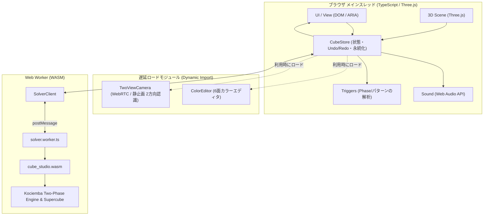

# Cube Studio (3x3-web-2)

ブラウザ上で動作する、高速・高機能な 3×3×3 ルービックキューブ・ソルバー＆シミュレータです。  
Rust で実装された Kociemba 2段階探索エンジンを WebAssembly (WASM) にコンパイルし、Web Worker 上でバックグラウンド実行します。フロントエンドは TypeScript + Vite + Three.js で構築され、PWA による完全なオフライン動作に対応しています。

[](https://katoy.github.io/rust-r-cube/3x3-v2/)
[](#)
[](https://www.typescriptlang.org/)
[](https://threejs.org/)
[](https://www.rust-lang.org/)

---

## 主な特徴

- ⚡ **Kociemba 2段階探索アルゴリズム**:
  - どのような混ざった状態からでも、通常 20手前後（平均 10〜30ms）で高速に解法を導出。
  - **スーパーキューブ（センターパーツの向き解決）対応**: 各面センターの 90°/180° の回転も保持・解消する高精度モードを搭載。
- 🧵 **Web Worker による非同期探索**:
  - 重い探索処理をバックグラウンド Worker で実行するため、3D アニメーションやユーザー操作が一切カクつきません。
- 🧊 **Three.js による 3D レンダリング & 2D フォールバック**:
  - スムーズな回転アニメーション、視点操作、ズーム。
  - **視点プリセット**: 標準（斜め見下ろし / Iso）、正面（Front）、上面（Top）、右面（Right）をワンクリックで切り替え可能。
  - WebGL が利用できない環境では 2D 展開図モードへ自動的にフォールバック。
- 🧩 **解法フェーズ分解 & トリガームーブ注釈**:
  - Kociemba 解法を Phase 1（エッジ・コーナーの方向整理、G1 群へ遷移）と Phase 2（完成への遷移）にステップ分割してバッジ表示。
  - Sexy Move (`R U R' U'`) や Sune などの有名トリガームーブパターンを自動検出してアノテーションタグを表示。
- 🔊 **Web Audio API による効果音 & キーボード入力フィードバック**:
  - キューブ回転時のリアルなクリック音、リセット音、解法完了時の通知音を合成出力。
  - キーボード操作時に対応するボタンが瞬時に光る視覚的キーフィードバック。
- 📷 **カメラ入力（WebRTC リアルタイム映像 & 2方向静止画）**:
  - WebRTC (`getUserMedia`) によるカメラ映像プレビューとリアルタイムフレームキャプチャ。
  - 2方向からの斜め写真（上面・右面・前面 / 下面・左面・背面）から、外周 6 角を指定して 6 面の色を一度に自動認識・透視射影変換補正。
  - 認識結果の確認・微調整ができるインタラクティブ修正パレット。
- 🔗 **URL による状態・解法・センター向きの共有**:
  - 現在のキューブ状態、スクランブル手順、センター方位を URL パラメータ（`?state=` / `?alg=` / `?centers=`）として共有可能。
  - 「共有リンク」ボタンからワンクリックで URL をクリップボードにコピー。
- 💾 **設定と状態の自動永続化**:
  - テーマ、再生速度、各種表示設定を `localStorage` に自動保存。
  - プライベートブラウズやストレージ無効環境でも動作する安全なメモリフォールバック。
- ♿ **アクセシビリティ（a11y）対応 & 自動監査**:
  - WCAG 2.1 AA レベルのコントラスト比と WAI-ARIA 仕様に準拠（タブリスト、ラジオグループ、キーボードナビゲーション）。
  - `@axe-core/playwright` による a11y 自動監査テストを CI に組み込み、高品質な操作性を維持。
- 📱 **PWA (Progressive Web App) 対応 & 自動プリキャッシュ**:
  - Service Worker と Web App Manifest を備え、スマートフォンやデスクトップにアプリとしてインストール可能。
  - ビルド時に生成される動的プリキャッシュ一覧（`scripts/generate-sw-precache.js`）により、初回訪問後から完全オフラインで利用可能。
  - Service Worker の更新検知と自動リロード機能。
- 🎓 **初心者向けガイダンス**:
  - 回転記号（U, R, F, D, L, B, ′, 2）の日本語・英語対応ツールチップ。
  - ヘルプダイアログ内の記号早見表。
- ⏩ **充実した再生コントロール**:
  - 自動再生、1手送り/戻し、再生速度変更（0.5×, 1×, 2×）。
  - 最初/最後へのジャンプボタン、キーボードショートカット（Home, End, Space, ←, →）。
  - 再生位置に連動した手順リストの自動スムーズスクロール。
- 🚀 **バンドルサイズと読み込み最適化**:
  - Three.js の独立ベンダーチャンク化。
  - カラーエディタやカメラモジュールを初回起動時の動的インポート（Dynamic Import）にすることで、初期 JS を軽量化。

---

## アーキテクチャ



---

## 開発と実行

### 前提環境

- **Rust**: 1.80 以上 (`wasm32-unknown-unknown` ターゲット)
- **wasm-pack**: 最新版 (`cargo install wasm-pack` または `npm install -g wasm-pack`)
- **Node.js**: v20 以上
- **npm**: v10 以上

### コマンド一覧

```bash
# 依存関係のインストール
npm install

# 開発サーバーの起動 (Vite: http://127.0.0.1:5173)
npm run dev

# ヘルパースクリプトでの起動（WASM自動チェック/再ビルド付き）
./start.sh
./start.sh --offline   # PWAキャッシュ構築後、オフライン状態（ネットワーク遮断）で起動
./start.sh --preview   # 本番ビルドを作成しローカルプレビュー起動
./start.sh --build     # WASM を再コンパイルしてから起動

# オフライン動作検証モードの直接起動 (npm)
npm run offline

# WASM ビルドのみ
npm run wasm

# 本番ビルド (WASM ビルド + 型チェック + Vite ビルド + SW プリキャッシュ生成)
npm run build

# 本番ビルド成果物 (dist/) のローカルプレビュー
npm run preview

# TypeScript 型チェック
npm run typecheck

# コードフォーマットチェック / 自動整形 (Prettier)
npm run format:check
npm run format

# Playwright E2E テストの実行
npm test

# カバレッジ計測付き E2E テスト
npm run test:coverage

# カメラ認識テスト（テスト画像自動生成 + テスト実行）
npm run test:camera

# Rust ソルバーの性能ベンチマーク
npm run benchmark

# Web アプリケーションの性能ベンチマーク
npm run benchmark:web

# 全体チェック (Rust fmt/clippy/test + Web format/typecheck/build/test)
npm run check
```

---

## テスト & 品質管理

本プロジェクトでは、信頼性と使いやすさを担保するために多角的なテストを実施しています。

- **Playwright E2E テスト**:
  - キューブの基本操作、回転アニメーション、Undo/Redo。
  - Kociemba 解法の導出とステップ再生。
  - WebRTC ライブカメラおよび静止画アップロードによる色認識（透視射影変換・パレット修正）。
  - URL パラメータによる状態復元（`?state=`, `?alg=`, `?centers=`）。
  - 設定の localStorage 永続化とストレージ無効化環境でのフォールバック。
  - PWA インストール、オフラインキャッシュ、Service Worker 更新検知。
- **アクセシビリティ (a11y) 監査**:
  - `@axe-core/playwright` を使用し、全主要画面で WCAG 2.1 AA レベルへの適合を自動検証。
- **Rust ユニットテスト & ベンチマーク**:
  - コーナー/エッジ座標変換の正確性。
  - 枝刈りテーブル（Pruning Table）生成およびキャッシュ整合性。
  - スーパーキューブのセンター回転解消アルゴリズム。

---

## デプロイ (GitHub Pages / 静的ホスティング)

### 1. GitHub Actions による自動デプロイ

リポジトリの `main` ブランチに push またはマージされると、GitHub Actions ワークフロー（`.github/workflows/deploy-pages.yml`）が起動します。
本モジュールは `npm run build` により `dist/` が生成され、GitHub Pages の `/3x3-v2/` パスに自動配置されます。

- **公開 URL**: `https://katoy.github.io/rust-r-cube/3x3-v2/`

### 2. 手動・他の静的ホスティングへのデプロイ

Vite の設定で相対パスベース（`base: "./"`）にビルドされるため、生成された `dist/` フォルダをそのまま任意の静的ウェブサーバー（GitHub Pages, Cloudflare Pages, Vercel, Netlify, Nginx, S3 等）に配置するだけで動作します。

```bash
# 本番向け成果物の生成 (dist/ ディレクトリ)
npm run build

# 生成された dist/ をプレビュー確認
npm run preview
```

---

## ディレクトリ構成

```
3x3-web-2/
├── Cargo.toml               # Rust WASM パッケージ定義
├── src/                     # Rust ソルバー実装 (Kociemba 2段階エンジン)
│   ├── lib.rs               # WASM バインディング
│   ├── cube.rs              # キューブ物理状態表現・回転操作
│   ├── coord.rs             # 座標変換・Kociemba 座標系
│   ├── search.rs            # IDA* 探索アルゴリズム
│   ├── supercube.rs         # スーパーキューブ（センター向き）探索
│   ├── tables.rs            # 移動テーブル・枝刈りテーブル
│   └── table_io.rs          # テーブルのバイナリ I/O
├── web/                     # TypeScript フロントエンド
│   ├── main.ts              # アプリケーションエントリポイント
│   ├── view.ts              # DOM 構築・ARIA 属性・イベント設定
│   ├── scene.ts             # Three.js 3D レンダリング & カメラ制御
│   ├── cube-store.ts        # 状態管理・Undo/Redo・localStorage 永続化
│   ├── sound.ts             # Web Audio API 効果音生成
│   ├── triggers.ts          # 解法フェーズ分割 & 有名トリガームーブ注釈
│   ├── solver-client.ts     # Web Worker 通信クライアント
│   ├── solver.worker.ts     # Web Worker スクリプト
│   ├── editor.ts            # 6面カラーエディタ (Dynamic Import)
│   ├── camera.ts            # カメラ入力・WebRTC キャプチャ (Dynamic Import)
│   ├── camera-geometry.ts   # 幾何計算・透視射影変換
│   ├── camera-ui-helper.ts  # 当たり判定・座標系ヘルパー
│   ├── camera-canvas-renderer.ts # ガイド枠・頂点描画
│   ├── camera-results-ui.ts # 読み取り展開図・修正パレット
│   ├── image-sampler.ts     # 画像色サンプリング・補正
│   ├── centers.ts           # センター方位データ構造
│   ├── model.ts             # データ型定義
│   └── pwa.ts               # Service Worker 登録・更新検知
├── scripts/                 # ビルド & テスト支援スクリプト
│   ├── launch-offline.js       # オフライン動作起動・検証スクリプト
│   ├── generate-sw-precache.js # SW プリキャッシュリスト自動生成
│   ├── generate-test-images.ts # カメラ認識テスト画像生成
│   └── generate-pwa-icons.js   # PWA アイコン生成
├── tests/                   # Playwright E2E テスト群
│   ├── accessibility.spec.ts   # axe-core a11y 監査
│   ├── app.spec.ts             # 基本 UI / 操作テスト
│   ├── camera-live.spec.ts     # WebRTC ライブカメラテスト
│   ├── camera-input.spec.ts    # 静止画色認識テスト
│   ├── solution-structure.spec.ts # フェーズ分割・トリガームーブ検証
│   ├── settings-persistence.spec.ts # 設定永続化テスト
│   ├── pwa.spec.ts             # PWA キャッシュ・オフライン動作
│   └── ...
├── public/                  # PWA アイコン・マニフェスト・Service Worker
├── index.html
├── vite.config.ts
└── playwright.config.ts
```

---

## ライセンス

[MIT License](../LICENSE)
