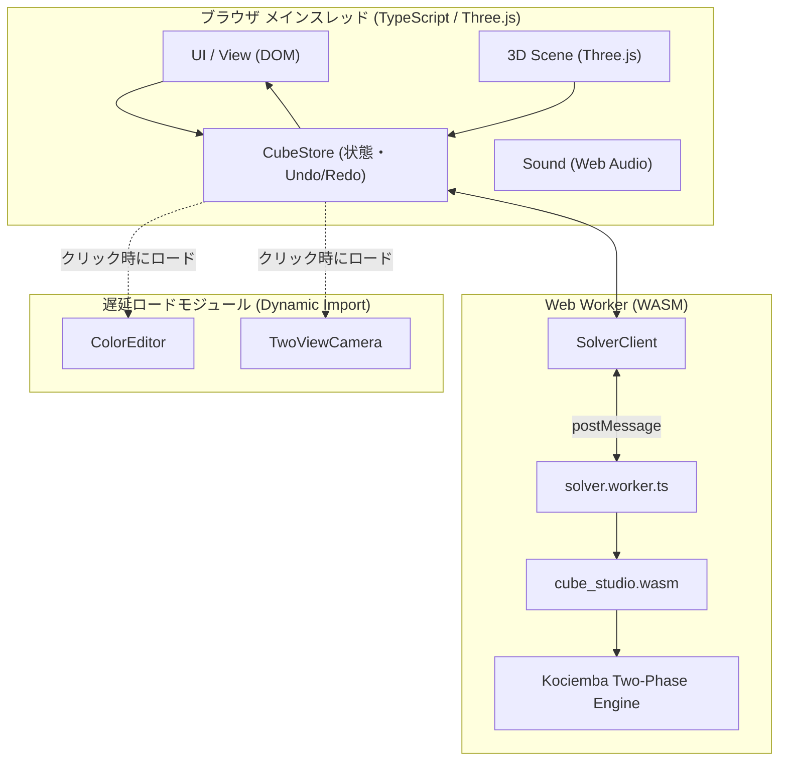

# Cube Studio (3x3-web-2)

ブラウザ上で動作する、高速・高機能な 3×3×3 ルービックキューブ・ソルバー＆シミュレータです。  
Rust で実装された Kociemba 2段階探索エンジンを WebAssembly (WASM) にコンパイルし、Web Worker 上でバックグラウンド実行します。フロントエンドは TypeScript + Vite + Three.js で構築され、PWA による完全なオフライン動作に対応しています。

[](https://katoy.github.io/rust-r-cube/3x3-v2/)
[](#)
[](https://www.typescriptlang.org/)
[](https://threejs.org/)
[](https://www.rust-lang.org/)

---

## 主な特徴

- ⚡ **Kociemba 2段階探索アルゴリズム**:
  - どのような混ざった状態からでも、通常 20手前後（平均 10〜30ms）で高速に解法を導出。
  - **スーパーキューブ（センターパーツの向き解決）対応**: 各面センターの 90°/180° の回転も保持・解消する高精度モードを搭載。
- 🧵 **Web Worker による非同期探索**:
  - 重い探索処理をバックグラウンド Worker で実行するため、3D アニメーションやユーザー操作が一切カクつきません。
- 🧊 **Three.js による 3D レンダリング & 2D フォールバック**:
  - スムーズな回転アニメーション、視点操作、ズーム。
  - WebGL が利用できない環境では 2D 展開図モードへ自動的にフォールバック。
- 📱 **PWA (Progressive Web App) 対応**:
  - Service Worker と Web App Manifest を備え、スマートフォンやデスクトップにアプリとしてインストール可能。
  - 一度アクセスすれば完全オフラインで利用可能。
- 📷 **2方向カメラ入力**:
  - 2方向からの斜め写真（上面・右面・前面 / 下面・左面・背面）から、外周 6 角を指定して 6 面の色を一度にキャプチャ・補正。
- 🎓 **初心者向けガイダンス**:
  - 回転記号（U, R, F, D, L, B, ′, 2）の日本語・英語対応ツールチップ。
  - ヘルプダイアログ内の記号早見表。
- ⏩ **充実した再生コントロール**:
  - 自動再生、1手送り/戻し、再生速度変更（0.5×, 1×, 2×）。
  - 最初/最後へのジャンプボタン、キーボードショートカット（Home, End, Space, ←, →）。
  - 再生位置に連動した手順リストの自動スムーズスクロール。
- 🚀 **バンドルサイズと読み込み最適化**:
  - Three.js の独立ベンダーチャンク化。
  - カラーエディタやカメラモジュールを初回起動時の動的インポート（Dynamic Import）にすることで、初期 JS を約 53KB に軽量化。

---

## アーキテクチャ



---

## 開発と実行

### 前提環境
- **Rust**: 1.80 以上 (`wasm32-unknown-unknown` ターゲット)
- **wasm-pack**: 最新版 (`cargo install wasm-pack` または `npm install -g wasm-pack`)
- **Node.js**: v20 以上
- **npm**: v10 以上

### コマンド

```bash
# 依存関係のインストール
npm install

# 開発サーバーの起動 (Vite)
npm run dev

# WASM ビルド + 型チェック + 本番バンドルビルド
npm run build

# 型チェックのみ
npm run typecheck

# コードフォーマットチェック
npm run format:check

# コードフォーマット整形
npm run format

# Playwright E2E テストの実行
npm test

# 全体チェック (Rust fmt/clippy/test + Web format/typecheck/build/test)
npm run check
```

---

## ディレクトリ構成

```
3x3-web-2/
├── Cargo.toml               # Rust WASM パッケージ定義
├── src/                     # Rust ソルバー実装 (Kociemba 2段階エンジン)
│   ├── lib.rs               # WASM バインディング
│   ├── cubie.rs             # キューブ物理状態表現
│   ├── coord.rs             # 座標変換・枝刈りテーブル
│   └── search.rs            # IDA* 探索アルゴリズム
├── web/                     # TypeScript フロントエンド
│   ├── main.ts              # エントリポイント
│   ├── view.ts              # DOM 生成・UI バインディング
│   ├── scene.ts             # Three.js 3D レンダリング
│   ├── cube-store.ts        # 状態管理・Undo/Redo
│   ├── solver-client.ts     # Worker 通信クライアント
│   ├── solver.worker.ts     # Web Worker
│   ├── editor.ts            # 6面カラーエディタ
│   ├── camera.ts            # カメラ入力メイン
│   ├── camera-geometry.ts   # 幾何計算・射影変換
│   ├── camera-ui-helper.ts  # 当たり判定・座標系ヘルパー
│   ├── camera-canvas-renderer.ts # ガイド枠・頂点描画
│   ├── camera-results-ui.ts # 読み取り展開図・修正パレット
│   └── pwa.ts               # Service Worker 登録
├── tests/                   # Playwright E2E テスト群
├── public/                  # PWA アイコン・マニフェスト・Service Worker
├── index.html
├── vite.config.ts
└── playwright.config.ts
```

---

## ライセンス

[MIT License](../LICENSE)
