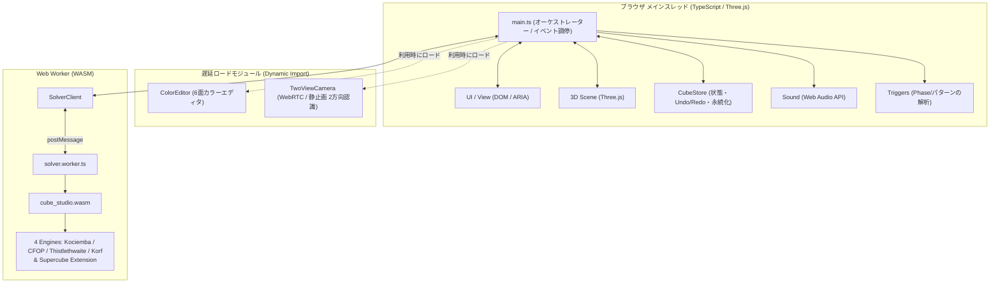

# Cube Studio (3x3-web-2)

ブラウザ上で動作する、高速・高機能な 3×3×3 ルービックキューブ・ソルバー＆シミュレータです。  
Rust で実装された Kociemba 2段階探索エンジンを WebAssembly (WASM) にコンパイルし、Web Worker 上でバックグラウンド実行します。フロントエンドは TypeScript + Vite + Three.js で構築され、PWA による完全なオフライン動作に対応しています。

[](https://katoy.github.io/rust-r-cube/3x3-v2/)
[](https://github.com/katoy/rust-r-cube/actions/workflows/3x3-web-2.yml)
[](https://www.typescriptlang.org/)
[](https://threejs.org/)
[](https://www.rust-lang.org/)

---

## 主な特徴

- 🧠 **4つの多彩な解法アルゴリズムを自由に選択可能**:
  - **Kociemba 2段階探索** (デフォルト): 速度と手数のバランスが最良（平均20手前後、10〜30ms）。
  - **CFOP / LBL**: 人間のスピードキューブ解法（Cross $\to$ F2L $\to$ OLL $\to$ PLL）。手順の意図が直感的に理解可能。
  - **Thistlethwaite**: 群論に基づく 4 段階部分群縮小法（$G_0 \to G_1 \to G_2 \to G_3 \to G_4$）。
  - **Korf (IDA*)**: 理論上の最短手（神の数字20手以内）を求める反復深化A*探索（タイムアウト時はKociemba準最適解へフォールバック）。
- ⚡ **Kociemba 2段階探索エンジン**:
  - どのような混ざった状態からでも、通常 20手前後（平均 10〜30ms）で高速に解法を導出。
  - **スーパーキューブ（センターパーツの向き解決）対応**: 各面センターの 90°/180° の回転も保持・解消する高精度モードを搭載。Phase 1 での奇数センター回転数下界枝刈り（`min_phase1_center_moves`）および Phase 2 での $180^\circ$ センター枝刈り（`min_phase2_center_moves`）により無駄な探索ノードを最小化。
- 🧵 **Web Worker による非同期探索**:
  - 重い探索処理をバックグラウンド Worker で実行するため、3D アニメーションやユーザー操作が一切カクつきません。
- 🧊 **Three.js による 3D レンダリング & 2D フォールバック**:
  - スムーズな回転アニメーション、視点操作、ズーム。
  - **視点プリセット**: 標準（斜め見下ろし / Iso）、正面（Front）、上面（Top）、右面（Right）をワンクリックで切り替え可能。
  - WebGL が利用できない環境では 2D 展開図モードへ自動的にフォールバック。
- 🧩 **解法フェーズ分解 & トリガームーブ注釈**:
  - Kociemba 解法を Phase 1（エッジ・コーナーの方向整理、G1 群へ遷移）と Phase 2（完成への遷移）にステップ分割してバッジ表示。
  - Sexy Move (`R U R' U'`) や Sune などの有名トリガームーブパターンを自動検出してアノテーションタグを表示。
- 🔊 **Web Audio API による効果音 & キーボード入力フィードバック**:
  - キューブ回転時のリアルなクリック音、リセット音、解法完了時の通知音を合成出力。
  - キーボード操作時に対応するボタンが瞬時に光る視覚的キーフィードバック。
- 📷 **カメラ入力（WebRTC リアルタイム映像 & 2方向静止画）**:
  - WebRTC (`getUserMedia`) によるカメラ映像プレビューとリアルタイムフレームキャプチャ。
  - 2方向からの斜め写真（上面・右面・前面 / 下面・左面・背面）から、外周 6 角を指定して 6 面の色を一度に自動認識・透視射影変換補正。
  - 認識結果の確認・微調整ができるインタラクティブ修正パレット。
- 🔗 **URL による状態・解法・センター向きの共有**:
  - 現在のキューブ状態、スクランブル手順、センター方位を URL パラメータ（`?state=` / `?alg=` / `?centers=`）として共有可能。
  - 「共有リンク」ボタンからワンクリックで URL をクリップボードにコピー。
- 💾 **設定と状態の自動永続化**:
  - キューブ状態、センター向き、再生速度、選択アルゴリズム、アニメーション軽減設定、効果音設定を `localStorage` に自動保存。
  - プライベートブラウズやストレージ無効環境でも動作する安全なメモリフォールバック。
- ♿ **アクセシビリティ（a11y）対応 & 自動監査**:
  - WCAG 2.1 AA レベルのコントラスト比と WAI-ARIA 仕様に準拠（タブリスト、ラジオグループ、キーボードナビゲーション）。
  - `@axe-core/playwright` による a11y 自動監査テストを CI に組み込み、高品質な操作性を維持。
- 📱 **PWA (Progressive Web App) 対応 & 自動プリキャッシュ**:
  - Service Worker と Web App Manifest を備え、スマートフォンやデスクトップにアプリとしてインストール可能。
  - ビルド時に生成される動的プリキャッシュ一覧（`scripts/generate-sw-precache.js`）により、初回訪問後から完全オフラインで利用可能。
  - **世代管理型 Cache Migration**: Service Worker 更新時、直近 1 世代の旧キャッシュから未登録資産を最大 15 件まで安全に引き継ぎつつ、過去世代の古いキャッシュを完全破棄してストレージ肥大化（Cache Bloat）を根本防止。
  - Service Worker の更新検知と遅延ロード保護（最新版への安全なリロード案内と状態の自動永続化）。
- 🎓 **初心者向けガイダンス**:
  - 回転記号（U, R, F, D, L, B, ′, 2）の日本語・英語対応ツールチップ。
  - ヘルプダイアログ内の記号早見表。
- ⏩ **充実した再生コントロール**:
  - 自動再生、1手送り/戻し、再生速度変更（0.5×, 1×, 2×）。
  - 最初/最後へのジャンプボタン、キーボードショートカット（Home, End, Space, ←, →）。
  - 再生位置に連動した手順リストの自動スムーズスクロール。
- 🚀 **バンドルサイズと読み込み最適化**:
  - Three.js、WASM、カメラ・エディタを適切にコード分割し、初回起動の軽快さを両立。

---

## アルゴリズム詳細

### 1. Kociemba 2段階探索アルゴリズム (Two-Phase Algorithm)
- **アプローチ**: Herbert Kociemba（1992年）によって考案された、群論に基づく2段階探索。
  - **Phase 1** ($G_0 \to G_1$): 全エッジの向き（Flip）とコーナーの向き（Twist）を揃え、中層エッジを中層スライス（$U$-$D$ スライス）に集約（$G_1$ 部分群へ遷移）。
  - **Phase 2** ($G_1 \to G_2$): 回転操作を $\langle U, D, R^2, L^2, F^2, B^2 \rangle$ の 10 種に制限し、完成状態 $G_2$ を探索。
- **特徴**: 事前計算された巨大な移動テーブル（Move Tables）と枝刈りテーブル（Pruning Tables）をメモリ上に展開し、IDA*（反復深化A*）探索によって瞬時に準最適解（通常 20手前後）を導出します。

### 2. CFOP 解法 (Fridrich Method / LBL)
- **アプローチ**: Jessica Fridrich 教授らによって体系化された、現代のスピードキューブにおける世界標準解法（Layer By Layer）。
  - **Cross**: 下面（白面）の十字エッジを揃える
  - **First Layer (Corner)**: 第1層のコーナーを揃えて完全1面を完成
  - **Second Layer (Edge)**: 中層の4エッジを配置して第2層まで完成
  - **OLL (Orientation of the Last Layer)**: 2段階（十字エッジ向き $\to$ コーナー向き）で上面の色を一色に揃える
  - **PLL (Permutation of the Last Layer)**: 2段階（コーナー位置 $\to$ エッジ位置）で上面の最終位置を揃えて完成
- **特徴**: 人間が目で見て解く手順を忠実に再現しているため、解法の1手1手の意図（「いまどのパーツを揃えているか」）が直感的に理解できます。

### 3. Thistlethwaite アルゴリズム (4段階群縮小法)
- **アプローチ**: Morwen Thistlethwaite（1981年）によって考案された、群論による階層的解法。完全な自由回転群 $G_0$ から部分群への縮小を 4 段階繰り返します。
  - **Phase 1** ($G_0 \to G_1$): エッジの向きを解決 ($F, B$ 回転を半回転 $180^\circ$ に制限)
  - **Phase 2** ($G_1 \to G_2$): コーナーの向きと $U$-$D$ スライスのエッジ位置を解決 ($L, R$ 回転も $180^\circ$ に制限)
  - **Phase 3** ($G_2 \to G_3$): コーナー・エッジの各オービット位置を解決 (全回転を半回転 $180^\circ$ に制限)
  - **Phase 4** ($G_3 \to G_4$): 半回転のみですべての位置を揃えて完成
- **メリット**: 回転操作の制限が段階的に厳しくなり、最終的にすべて $180^\circ$ 回転だけで揃っていく群論の美しさを体感できます。

### 4. Korf アルゴリズム (IDA* 最短探索 ＋ Kociemba ハイブリッド)
- **アプローチ**: Richard Korf（1997年）の最短探索法をベースに、WebAssembly / ブラウザ環境向けに最適化した反復深化A*（IDA*）ハイブリッド探索。
- **ヒューリスティック**: Kociemba の Phase 1 枝刈りテーブル（Twist/Slice, Flip/Slice PDB）および各ピース配置から導出した数学的に厳密な下界（Admissible Heuristic）を用い、過大評価なく探索空間を剪定します。
- **探索とフォールバック**:
  - 指定された時間予算（デフォルト5秒等）かつ深さ12手以内で IDA* が完了した場合は、**完全最短解**を出力します（UIに「Korf 最短探索 (IDA*)」と表示）。
  - 時間予算上限または深さ上限（12手）に達した場合は、残余予算内で Kociemba 探索へフォールバックし、失敗時はエラーを返します（フォールバック時はUIに「Kociemba フォールバック」と明記され、最短手とは区別されます）。

---

### 📊 アルゴリズム比較表

| アルゴリズム | 基本アプローチ | 通常の平均手数<br>(色のみ) | **セルの向きを揃える手数**<br>*(スーパーキューブ)* | **Superflip 解法手数**<br>*(色のみ / センター考慮)* | 探索速度 | スーパーキューブ対応 | 主な用途・特徴 |
| :--- | :--- | :---: | :---: | :---: | :---: | :---: | :--- |
| **Kociemba (Two-Phase)** <br>*(デフォルト)* | 2段階部分群探索<br>($G_0 \to G_1 \to G_2$) | 約 20〜22手 | **約 22〜28手**<br>(平均 24〜26手) | **21手 / 23手**<br>*(最短20手に対する準最短解)* | 高速<br>(通常 10〜30ms) | ✅ **同時最適化対応**<br>(後付けフォールバック有) | 速度・手数のバランスが最良。日常の解法導出に最適。 |
| **CFOP (LBL)** | 5段階階層解法<br>(Cross $\to$ 角 $\to$ 縁 $\to$ OLL $\to$ PLL) | **75〜155手**<br>*(実測中央値 120手)* | 色解法後に後付け定石補正 | **136手 / 169手**<br>*(本実装の手順値: 136手 + 補正42手、相殺後169手)* | 高速<br>(十数〜数十ms) | 🟡 **後付け補正対応**<br>(定石マクロで調整) | 人間向け標準解法。本実装は簡易 LBL のため手数長めですが各段階が明確。 |
| **Thistlethwaite** | 4段階部分群縮小<br>($G_0 \to \cdots \to G_4$) | 約 30〜45手 | 色解法後に後付け定石補正 | **31手 / 95手**<br>*(4段階群縮小: 31手 + 補正64手)* | 高速<br>(5〜50ms) | 🟡 **後付け補正対応**<br>(定石マクロで調整) | 群論の古典的名作。回転制約が狭まる過程を観察可能。 |
| **Korf (IDA*)** | 反復深化A* 最短探索<br>(予算超過時フォールバック) | **最短**<br>(予算内・深さ12手以内)<br>超過時はフォールバック | 色解法後に後付け定石補正 | **21手 / 73手**<br>*(フォールバック準最適解 / 補正時)* | 浅い手は即時<br>深い手は予算制限 | 🟡 **後付け補正対応**<br>(定石マクロで調整) | 浅い局面で理論上の最短手数を求めたい場合に最適。超過時は Kociemba 準最適解。 |

> [!TIP]
> **セルの向き（センターの向き / スーパーキューブ）について**:  
> 通常の無地ルービックキューブは各面の中央のセル（センターパーツ）の回転角（90°/180°）が見た目に現れませんが、イラスト・ロゴ入りキューブやスーパーキューブではセンターセルの向きも正確に揃える必要があります。  
> - **Kociemba ソルバー**: 探索段階でセンターセルの回転群を追跡し、色だけでなく 6 面すべてのセンターの向きを元の向き（0°）に復元する解法を直接探索します（同時最適化。失敗時は後付け補正へ自動フォールバック）。  
> - **CFOP / Thistlethwaite / Korf ソルバー**: 外周（エッジ・コーナー）の色を解いた後、共通のセンター後付け補正処理（`supercube::solve_center_orientations`）を呼んでセンターパーツの向きを揃えます。色解法とセンター補正の接合部で発生する冗長な手は `cancel_redundant_moves_with_phases` によって自動相殺・統合されます。

#### 🔄 色のみ解決した後、セルの向きを揃えるのには何手が必要か？

外周（エッジ・コーナー）の色を完成させた状態から、外周の配置を一切崩さずに**後からセルの向き（センターパーツの向き）だけを揃える**場合、現在の定石合成生成器は **0〜124手 (HTM)** の補正手順を返します。合法なセンター構成全2048通り（各面0〜3四半回転、総和偶数）を走査した実装上の最大は **124手**（例: 全6面が +90° の `[1; 6]`）です。これは理論最短手数の上限ではありません。下表の12〜60手は代表的な1面・2面の構成であり、全6面の最大ではありません。

##### 1. ズレのパターン別・後付け必要手数 (HTM)
ルービックキューブの力学上、**「単独の 1 つのセンターだけを 90° 回す」ことは数学的に不可能**です（全センターの四半回転の総和は偶数でなければならない）。そのため、以下の定石手順を適用して解消します。

| ズレているセルの状態 | 本アプリ実装手数 (HTM) | 代表的な定石手順 | 備考 |
| :--- | :---: | :--- | :--- |
| **1つのセンターを 180° 回転** | **12手** | `(U R L U2 R' L') × 2` | 外周を崩さず 1 面のセンターのみを半回転させる最短手順。 |
| **隣接する 2 つのセンターを 90° 相殺**<br>(例: U面 +90° / F面 -90°) | **30手** | 定石マクロの合成 | 異符号ペアの相殺定石を適用。 |
| **同方向の 2 つのセンターが 90°**<br>(例: U面 +90° / R面 +90°) | **42手** | 相殺マクロ ＋ 180°補正の合成 | 総和偶数条件を満たすため適法。相殺と半回転を組み合わせて解決。 |
| **対向する 2 つのセンターを 90° 相殺**<br>(例: U面 +90° / D面 -90°) | **60手** | 独立定石マクロの合成 | 中間面を経由した定石の合成により手数が長くなります。 |

##### 2. 「後付け補正方式」vs「同時最適化方式 (Cube Studio)」
| アプローチ | 解決の流れ | 解法全体の総手数 | 特徴 |
| :--- | :--- | :---: | :--- |
| **後付け補正方式**<br>*(逐次解決: CFOP / Thistlethwaite / Korf)* | ① 通常通り色だけを解く<br>② 後からセンター回転定石を適用（**+0〜124手**）<br>③ 接合部の冗長手をフェーズ整合相殺 | **色の解法手数 + 補正手数 - 相殺手** | 各ステップの意図は把握しやすいが、総手数が大幅に長くなる。 |
| **同時最適化方式**<br>*(Cube Studio の Kociemba)* | 探索時に「色完成かつセンター累積回転が0」となる解を IDA* で直接探索 | **約 22〜28手**<br>*(増加わずか **+2〜6手**)* | 最短に近い手数を瞬時に導出。最も効率的。 |

> [!NOTE]
> **Superflip（スーパーフリップ）について**:  
> すべてのコーナーが揃ったまま、12 個の全エッジパーツだけが反転した状態で、ルービックキューブにおいて「最短でも 20 手を要する」ことが数学的に証明されている代表的な最難関配置（God's Number = 20 の証明例）です。
> - 20手は **色のみの数学的な理論最短手数（下界）**（HTM: 180°回転も1手）です。探索ソルバーが常に20手を返すという意味ではありません。根拠は [God's Number is 20](https://www.cube20.org/) を参照してください。
> - プリセットは `U R2 F B R B2 R U2 L B2 R U' D' R2 F R' L B2 U2 F2` で生成します。センターの向きもこの手順から引き継ぎます。
> - **Kociemba**: 色のみは準最短の **21手**、センター向き同時最適化時は **23手** で解決します。
> - **CFOP**: 人間向け定石を各ステップで適用するため、本実装では色のみ **136手**、センター向き後付け補正時は接合部相殺により **169手**（色解決 127手 + センター補正 42手）となります。
> - **Korf**: 深さ12手を超えるため Kociemba 準最適解へフォールバックし、色のみ **21手**、センター後付け補正時は **73手**（21手 + センター補正52手）で解決します。
> - **Thistlethwaite**: 4段階部分群縮小法により、色のみ **31手**（Phase 1: 7, Phase 2: 8, Phase 3: 6, Phase 4: 10）、センター向き後付け補正時は **95手**（31手 + センター補正64手）で解決します。

---

## アーキテクチャ


```mermaid
flowchart TD
    subgraph App ["ブラウザ メインスレッド (TypeScript / Three.js)"]
        Main["main.ts (オーケストレーター / イベント調停)"]
        View["UI / View (DOM / ARIA)"]
        Scene["3D Scene (Three.js)"]
        Store["CubeStore (状態・Undo/Redo・永続化)"]
        Sound["Sound (Web Audio API)"]
        Triggers["Triggers (Phase/パターンの解析)"]

        Main <--> View
        Main <--> Scene
        Main <--> Store
        Main --> Sound
        Main --> Triggers
    end

    subgraph Dynamic ["遅延ロードモジュール (Dynamic Import)"]
        Editor["ColorEditor (6面カラーエディタ)"]
        Camera["TwoViewCamera (WebRTC / 静止画 2方向認識)"]
        Main -.->|利用時にロード| Editor
        Main -.->|利用時にロード| Camera
    end

    subgraph Worker ["Web Worker (WASM)"]
        Client["SolverClient"]
        WasmWorker["solver.worker.ts"]
        RustWasm["cube_studio.wasm"]
        Solver["4 Engines: Kociemba / CFOP / Thistlethwaite / Korf<br>& Supercube Extension"]
        Main <--> Client
        Client <-->|postMessage| WasmWorker
        WasmWorker --> RustWasm
        RustWasm --> Solver
    end
```

---

## 開発と実行

### 前提環境

- **Node.js**: `^20.19.0 || >=22.12.0`（Vite 8 / TypeScript 7 / 依存ツールの要求バージョン）
- **Rust**: 1.87 以上 (`wasm32-unknown-unknown` ターゲット)。`Cargo.toml` の `rust-version` と一致し、CI で Rust 1.87.0 / ロック済み依存関係の native・WASM コンパイルを検証します。
- **wasm-pack**: 最新版 (`cargo install wasm-pack` または `npm install -g wasm-pack`)
- **npm**: v10 以上

### 初回セットアップと起動手順

クリーンなリポジトリ環境では、Git管理外の WASM バインディング (`pkg/`) が未生成であるため、開発サーバー起動や型検査の前に WASM のビルドが必要です。

```bash
# 1. 依存関係のインストール
npm install

# 2. WASM バインディングのビルド (pkg/ の生成)
npm run wasm

# 3. 開発サーバーの起動 (Vite: http://127.0.0.1:5173)
npm run dev

# または、ヘルパースクリプトを使用（WASM 未ビルド時は自動でビルドを実行）
./start.sh
```

### コマンド一覧

```bash
# ヘルパースクリプトでの起動（WASM自動チェック/再ビルド付き）
./start.sh
./start.sh --offline   # PWAキャッシュ構築後、オフライン状態（ネットワーク遮断）で起動
./start.sh --preview   # 本番ビルドを作成しローカルプレビュー起動
./start.sh --build     # WASM を再コンパイルしてから起動

# オフライン動作検証モードの直接起動 (npm)
npm run offline

# WASM ビルドのみ
npm run wasm

# 本番ビルド (WASM ビルド + 型チェック + Vite ビルド + SW プリキャッシュ生成)
npm run build

# 本番ビルド成果物 (dist/) のローカルプレビュー
npm run preview

# TypeScript 型チェック (pkg/ 生成済みであることが前提)
npm run typecheck

# コードフォーマットチェック / 自動整形 (Prettier)
npm run format:check
npm run format

# Playwright E2E テストの準備と実行
npx playwright install --with-deps chromium   # 初回のみ: Playwright Chromium の導入
npm run build                               # PWA・本番プレビュー検証 (4173) のため事前ビルドを推奨
npm test                                    # E2E テスト実行 (主テスト: dev 5173、PWA・オフライン: preview 4173)

# カバレッジ計測付き E2E テスト
npm run test:coverage

# カメラ認識テスト（テスト画像自動生成 + テスト実行）
npm run test:camera

# Rust ソルバーの性能ベンチマーク
npm run benchmark

# Superflip 各アルゴリズム手数ベンチマーク (Kociemba / CFOP / Thistlethwaite / Korf)
npm run benchmark:superflip

# Web アプリケーションの性能ベンチマーク
npm run benchmark:web

# 全体チェック (Rust fmt/clippy/test + Web format/build/test)
npm run check
```

オフライン検証の鮮度保証、配信物の同一性確認、タイムアウトとポート指定については [Offline verification](docs/offline-verification.md) を参照してください。

---

## テスト & 品質管理

本プロジェクトでは、数学的整合性・信頼性・アクセシビリティを担保するために多角的なテストを実施しています。

- **Rust 単体テスト & アルゴリズム理論検証 (`src/tests.rs`)**:
  - `cargo test` により実行される 140 件以上の単体テスト。
  - **主要モジュールの状態検証**: 座標系変換（`coord.rs`）、枝刈りテーブル生成・整合性（`tables.rs`）、スーパーキューブセンター補正（`supercube.rs`）の状態遷移と境界値。
  - **Superflip 手数・下界整合性テスト**:
    - **God's Number 下界検証**: センター向き無視・考慮のいずれにおいても、解法手数が数学的最小手数 **20手以上**（神の数字）であることを検証。
    - **CFOP (LBL)**: 本実装の手順値が、色のみ **136手**、センター向き補正・フェーズ間相殺を含め **169手** と一致し、配色・センター向きが完成することを検証。これらは理論最短手数ではありません。
    - **Kociemba**: 色のみ・センター向き同時最適化ともに **20〜24手** の範囲、各フェーズの境界、配色・センター向きの完成を検証。比較表の **21手 / 23手** は実測例で、固定値の検証ではありません。
    - **Thistlethwaite**: 群論的 4段階部分群縮小（$G_0 \to \cdots \to G_4$）による色解法 **31手** と、センター補正を付加した解法の配色完成・手数の非減少を検証。比較表の補正込み **95手** は実測例です。
    - **Korf (IDA*)**: 深さ12手超過時の Kociemba フォールバック、色解法の **20手以上**、補正付加後の配色完成・手数の非減少を検証。比較表の **21手 / 73手** は実測例です。
- **Playwright E2E テスト (`tests/`)**:
  - フロントエンドの操作、回転アニメーション、Undo/Redo、解法のステップ再生。
  - WebRTC ライブカメラおよび静止画アップロードによる色認識（ホモグラフィ透視射影変換・パレット修正）。
  - URL パラメータによる状態復元（`?state=`, `?alg=`, `?centers=`, `?solver=`）。
  - 設定の localStorage 永続化とストレージ無効化環境でのフォールバック。
  - PWA インストール、オフラインキャッシュ、Service Worker 更新検知。
- **CDP 行カバレッジ (`npm run test:coverage`)**:
  - `web/*.ts` の期待モジュール棚卸しを照合し、空測定・欠落・重複を拒否します。配信された変換後 JavaScript の行を計測し、既存の各モジュール閾値を適用します（元 TypeScript の分岐カバレッジではありません）。
  - `solver.worker.ts` は別 Worker isolate のため page CDP の対象外です。`app.spec.ts` の探索・再生と `code-review-b605038-regression.spec.ts` のキャンセルが Worker を独立に検証します。
  - CSS と Rust/WASM 内部はこの計測の対象外です。WASM import ラッパーの JavaScript カバレッジは Rust/WASM 内部のカバレッジを意味しません。
- **アクセシビリティ (a11y) 監査**:
  - `@axe-core/playwright` を使用し、主要画面で WCAG 2.1 AA レベルへの適合を自動検証。

> [!NOTE]
> **テストディレクトリの配置方針**:  
> 本リポジトリでは言語とテスト責務を明確に分離しています：
> - `src/tests.rs`: Rust クレート内部の探索アルゴリズムやデータ構造を検証する **Rust 単体テスト（Unit Tests）**。
> - `tests/`: ブラウザ UI 全体の統合動作を検証する **TypeScript / Playwright E2E テスト**。

---

## デプロイ (GitHub Pages / 静的ホスティング)

### 1. GitHub Actions による自動デプロイ

リポジトリの `main` ブランチに push またはマージされると、GitHub Actions ワークフロー（`.github/workflows/deploy-pages.yml`）が起動します。
本モジュールは `npm run build` により `dist/` が生成され、GitHub Pages の `/3x3-v2/` パスに自動配置されます。

- **公開 URL**: `https://katoy.github.io/rust-r-cube/3x3-v2/`

### 2. 手動・他の静的ホスティングへのデプロイ

Vite の設定で相対パスベース（`base: "./"`）にビルドされるため、生成された `dist/` フォルダをそのまま任意の静的ウェブサーバー（GitHub Pages, Cloudflare Pages, Vercel, Netlify, Nginx, S3 等）に配置するだけで動作します。

```bash
# 本番向け成果物の生成 (dist/ ディレクトリ)
npm run build

# 生成された dist/ をプレビュー確認
npm run preview
```

---

## ディレクトリ構成

```
3x3-web-2/
├── Cargo.toml               # Rust WASM パッケージ定義
├── cubes/                   # 状態プリセット JSON (superflip.json 等)
├── src/                     # Rust ソルバー実装 (4種の探索エンジン)
│   ├── lib.rs               # WASM バインディング & アルゴリズムディスパッチ
│   ├── cube.rs              # キューブ物理状態表現・回転操作
│   ├── coord.rs             # 座標変換・Kociemba 座標系
│   ├── search.rs            # Kociemba 2段階探索アルゴリズム
│   ├── cfop.rs              # CFOP (Layer-By-Layer) 階層解法ソルバー
│   ├── thistlethwaite.rs    # Thistlethwaite 4段階群縮小ソルバー
│   ├── korf.rs              # Korf IDA* 最短解探索ソルバー
│   ├── supercube.rs         # スーパーキューブ（センター向き）探索
│   ├── tables.rs            # 移動テーブル・枝刈りテーブル
│   ├── table_io.rs          # テーブルのバイナリ I/O
│   ├── bin/                 # ベンチマーク CLI バイナリ
│   │   ├── benchmark.rs     # ソルバー総合性能ベンチマーク
│   │   └── superflip_bench.rs # Superflip 各アルゴリズム手数ベンチマーク
│   └── tests.rs             # Rust 単体テスト & Superflip 手数・下界整合性テスト
├── web/                     # TypeScript フロントエンド
│   ├── main.ts              # アプリケーションエントリポイント
│   ├── view.ts              # DOM 構築・ARIA 属性・イベント設定
│   ├── scene.ts             # Three.js 3D レンダリング & カメラ制御
│   ├── cube-store.ts        # 状態管理・Undo/Redo・localStorage 永続化
│   ├── sound.ts             # Web Audio API 効果音生成
│   ├── triggers.ts          # 解法フェーズ分割 & 有名トリガームーブ注釈
│   ├── solver-client.ts     # Web Worker 通信クライアント
│   ├── solver.worker.ts     # Web Worker スクリプト
│   ├── editor.ts            # 6面カラーエディタ (Dynamic Import)
│   ├── camera.ts            # カメラ入力・WebRTC キャプチャ (Dynamic Import)
│   ├── camera-geometry.ts   # 幾何計算・透視射影変換
│   ├── camera-ui-helper.ts  # 当たり判定・座標系ヘルパー
│   ├── camera-canvas-renderer.ts # ガイド枠・頂点描画
│   ├── camera-results-ui.ts # 読み取り展開図・修正パレット
│   ├── image-sampler.ts     # 画像色サンプリング・補正
│   ├── centers.ts           # センター方位データ構造
│   ├── model.ts             # データ型定義
│   └── pwa.ts               # Service Worker 登録・更新検知
├── scripts/                 # ビルド & テスト支援スクリプト
│   ├── launch-offline.js       # オフライン動作起動・検証スクリプト
│   ├── generate-sw-precache.js # SW プリキャッシュリスト自動生成
│   ├── generate-test-images.js # カメラ認識テスト画像生成
│   └── generate-pwa-icons.js   # PWA アイコン生成
├── tests/                   # Playwright E2E テスト群
│   ├── accessibility.spec.ts   # axe-core a11y 監査
│   ├── app.spec.ts             # 基本 UI / 操作テスト
│   ├── camera-live.spec.ts     # WebRTC ライブカメラテスト
│   ├── camera-input.spec.ts    # 静止画色認識テスト
│   ├── solution-structure.spec.ts # フェーズ分割・トリガームーブ検証
│   ├── settings-persistence.spec.ts # 設定永続化テスト
│   ├── pwa.spec.ts             # PWA キャッシュ・オフライン動作
│   └── ...
├── public/                  # PWA アイコン・マニフェスト・Service Worker
├── index.html
├── vite.config.ts
└── playwright.config.ts
```

---

## ライセンス

[MIT License](../LICENSE)
