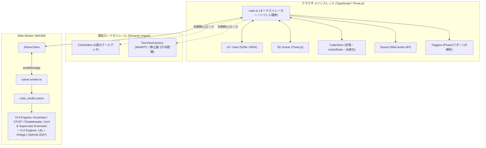

# Cube Studio (3x3-web-2)

ブラウザ上で動作する、高速・高機能な 3×3×3 ＆ 2×2×2 ルービックキューブ・ソルバー＆シミュレータです。  
Rust で実装された各種探索エンジン（3×3×3 の Kociemba 2段階探索 / CFOP / Thistlethwaite / Korf IDA*、および 2×2×2 の LBL法 / Ortega法 / 完全最短 IDA* 探索）を WebAssembly (WASM) にコンパイルし、Web Worker 上でバックグラウンド実行します。フロントエンドは TypeScript + Vite + Three.js で構築され、PWA による完全なオフライン動作に対応しています。

[](https://katoy.github.io/rust-r-cube/3x3-v2/)
[](https://github.com/katoy/rust-r-cube/actions/workflows/3x3-web-2.yml)
[](https://www.typescriptlang.org/)
[](https://threejs.org/)
[](https://www.rust-lang.org/)

---

## 主な特徴

- 🎲 **3×3×3 ＆ 2×2×2 キューブ両対応**:
  - ヘッダーのボタンからワンクリックで 3×3×3 と 2×2×2 を瞬時にシームレス切り替え。
  - 3D ビュー（Three.js）もキューブタイプに応じて自動再構築。手動回転、Undo/Redo、アニメーション再生も両サイズで完全に動作。
  - 2×2×2 専用のプリセット（市松模様、手動スクランブル等）、24 マスのカラーエディタ、およびカメラ認識（2方向静止画・WebRTC からの 24 ステッカー自動認識・展開図補正）にも完全対応。
- 🧠 **多彩な解法アルゴリズムを自由に選択可能**:
  - **【3×3×3】Kociemba 2段階探索** (デフォルト): 速度と手数のバランスが最良（平均20手前後、10〜30ms）。
  - **【3×3×3】CFOP / LBL**: 人間のスピードキューブ解法（Cross $\to$ F2L $\to$ OLL $\to$ PLL）。手順の意図が直感的に理解可能。
  - **【3×3×3】Thistlethwaite**: 群論に基づく 4 段階部分群縮小法（$G_0 \to G_1 \to G_2 \to G_3 \to G_4$）。
  - **【3×3×3】Korf (IDA*)**: 理論上の最短手（神の数字20手以内）を求める反復深化A*探索（タイムアウト時はKociemba準最適解へフォールバック）。
  - **【2×2×2】LBL法 (Layer-by-Layer)** (デフォルト): 初心者向け王道3ステップ解法（完全1層 $\to$ 上面色OLL $\to$ 上面配置PLL）。各ステップの解説や公式バッジで学習に最適。
  - **【2×2×2】Ortega法 (オルテガ法)**: 競技スピード解法（最初の1面 $\to$ 反対面色OLL $\to$ 両層同時配置PBL）。
  - **【2×2×2】Optimal 最短探索 (IDA*)**: 理論上の完全最短解（神の数字11手以内）を数ミリ秒以内で瞬時に導出。
- ⚡ **Rust + WebAssembly による高速探索エンジン**:
  - 3×3×3 ではスーパーキューブ（センターパーツの向き解決）もサポート。Phase 1 での奇数センター回転数下界枝刈り（`min_phase1_center_moves`）および Phase 2 での $180^\circ$ センター枝刈り（`min_phase2_center_moves`）により無駄な探索ノードを最小化。
  - 2×2×2 では DBL コーナーを固定基準とすることで全体の空間回転（24通り）を排除し、コーナー7個の向き（2,187通り）と位置（5,040通り）の直積空間（約 $1.1 \times 10^7$ 状態）から厳密な完全最短手（HTM 11手以内）を即時計算。
- 🧵 **Web Worker による非同期探索**:
  - 重い探索処理をバックグラウンド Worker で実行するため、3D アニメーションやユーザー操作が一切カクつきません。
- 🧊 **Three.js による 3D レンダリング & 2D フォールバック**:
  - 3×3×3（26ピース / 54ステッカー）および 2×2×2（8ピース / 24ステッカー）の美しい角丸 3D メッシュ表示。
  - スムーズな回転アニメーション、自由視点操作、ズーム。
  - **視点プリセット**: 標準（斜め見下ろし / Iso）、正面（Front）、上面（Top）、右面（Right）をワンクリックで切り替え可能。
  - WebGL が利用できない環境では 2D 展開図モードへ自動的にフォールバック。
- 🎯 **リアルタイム矢印インジケーター & 向き凡例（3×3×3）**:
  - 各セル表面に印刷された矢印の向きと色により、ピース本来の向き（オリエンテーション）をリアルタイム可視化。
  - **4色のインジケーター**: 🟢 **エメラルドグリーン (正常)** / 🔴 **ローズピンク (コーナーねじれ)** / 🔵 **エレクトリックシアン (エッジ反転)** / 🟡 **アンバーゴールド (センター回転)**。
  - 3D ステージ上部の凡例バーで、各ピース状態の発生数を動的にカウント表示。解法アニメーションの進行に伴って警告色が減り、緑（正常）に揃っていく様子を直感的に把握可能。
  - ワンタップで色の意味がわかる解説ポップオーバー、およびヘルプダイアログ内の早見表を搭載。
  - 2×2×2 キューブ選択時は凡例を自動非表示化。
- 🧩 **解法フェーズ分解 & トリガームーブ注釈**:
  - 3×3×3 Kociemba 解法を Phase 1（エッジ・コーナーの方向整理、G1 群へ遷移）と Phase 2（完成への遷移）にステップ分割してバッジ表示。
  - 2×2×2 LBL法（完全1層 $\to$ OLL $\to$ PLL）および Ortega法（下1面 $\to$ OLL $\to$ PBL）において、適用された公式名（Sune, T-perm, Adj-Adj 等）を含む日本語フェーズ名を動的バッジ表示。
  - Sexy Move (`R U R' U'`) や Sune などの有名トリガームーブパターンを自動検出してアノテーションタグを表示。
- 🔊 **Web Audio API による効果音 & キーボード入力フィードバック**:
  - キューブ回転時のリアルなクリック音、リセット音、手動操作および解法アニメーション完了時の達成ファンファーレ音（3×3×3 ＆ 2×2×2 両対応）を合成出力。
  - キーボード操作時に対応するボタンが瞬時に光る視覚的キーフィードバック。
- 📷 **カメラ入力（WebRTC リアルタイム映像 & 2方向静止画）**:
  - WebRTC (`getUserMedia`) によるカメラ映像プレビューとリアルタイムフレームキャプチャ。
  - 2方向からの斜め写真（上面・右面・前面 / 下面・左面・背面）から、外周 6 角を指定して 6 面の色を一度に自動認識・透視射影変換補正（3×3×3 ＆ 2×2×2 両対応）。
  - 2×2×2 では 4マス×6面 = 計24ステッカーの自動サンプリングと 2×2 展開図プレビューに対応（全セル編集可能）。
  - 認識結果の確認・微調整ができるインタラクティブ修正パレット。
- 🔗 **URL による状態・解法・キューブタイプの共有**:
  - キューブ状態（`?state=`）、キューブ種別（`?type=2x2` / `?type=3x3`）、解法アルゴリズム（`?solver=`）、スクランブル手順（`?alg=`）、センター方位（`?centers=`）を URL パラメータとして完全に共有可能。
  - 「共有リンク」ボタンからワンクリックで現在の盤面・選択ソルバーを反映した URL をクリップボードにコピー。
- 💾 **設定と状態の自動永続化**:
  - キューブ種別（3×3×3 / 2×2×2）、キューブ状態、センター向き、再生速度、選択アルゴリズム（2×2×2 の LBL/Ortega/Optimal を含む全7種）、アニメーション軽減設定、効果音設定を `localStorage` に自動保存。
  - プライベートブラウズやストレージ無効環境でも動作する安全なメモリフォールバック。
- ♿ **アクセシビリティ（a11y）対応 & 自動監査**:
  - WCAG 2.1 AA レベルのコントラスト比と WAI-ARIA 仕様に準拠（タブリスト、ラジオグループ、キーボードナビゲーション）。
  - `@axe-core/playwright` による a11y 自動監査テストを CI に組み込み、高品質な操作性を維持。
- 📱 **PWA (Progressive Web App) 対応 & 自動プリキャッシュ**:
  - Service Worker と Web App Manifest を備え、スマートフォンやデスクトップにアプリとしてインストール可能。
  - ビルド時に生成される動的プリキャッシュ一覧（`scripts/generate-sw-precache.js`）により、初回訪問後から完全オフラインで利用可能。
  - **世代管理型 Cache Migration**: Service Worker 更新時、直近 1 世代の旧キャッシュから未登録資産を最大 15 件まで安全に引き継ぎつつ、過去世代の古いキャッシュを完全破棄してストレージ肥大化（Cache Bloat）を根本防止。
  - Service Worker の更新検知と遅延ロード保護（最新版への安全なリロード案内と状態の自動永続化）。
- 🎓 **初心者向けガイダンス**:
  - 回転記号（U, R, F, D, L, B, ′, 2）の日本語・英語対応ツールチップ。
  - ヘルプダイアログ内の記号早見表。
- ⏩ **充実した再生コントロール**:
  - 自動再生、1手送り/戻し、再生速度変更（0.5×, 1×, 2×）。
  - 最初/最後へのジャンプボタン、キーボードショートカット（Home, End, Space, ←, →）。
  - 再生位置に連動した手順リストの自動スムーズスクロール。
- 🚀 **バンドルサイズと読み込み最適化**:
  - Three.js、WASM、カメラ・エディタを適切にコード分割し、初回起動の軽快さを両立。

---

## アルゴリズム詳細

### 1. Kociemba 2段階探索アルゴリズム (Two-Phase Algorithm)
- **アプローチ**: Herbert Kociemba（1992年）によって考案された、群論に基づく2段階探索。
  - **Phase 1** ($G_0 \to G_1$): 全エッジの向き（Flip）とコーナーの向き（Twist）を揃え、中層エッジを中層スライス（$U$-$D$ スライス）に集約（$G_1$ 部分群へ遷移）。
  - **Phase 2** ($G_1 \to G_2$): 回転操作を $\langle U, D, R^2, L^2, F^2, B^2 \rangle$ の 10 種に制限し、完成状態 $G_2$ を探索。
- **特徴**: 事前計算された巨大な移動テーブル（Move Tables）と枝刈りテーブル（Pruning Tables）をメモリ上に展開し、IDA*（反復深化A*）探索によって瞬時に準最適解（通常 20手前後）を導出します。

### 2. CFOP 解法 (Fridrich Method / LBL)
- **アプローチ**: Jessica Fridrich 教授らによって体系化された、現代のスピードキューブにおける世界標準解法（Layer By Layer）。
  - **Cross**: 下面（白面）の十字エッジを揃える
  - **First Layer (Corner)**: 第1層のコーナーを揃えて完全1面を完成
  - **Second Layer (Edge)**: 中層の4エッジを配置して第2層まで完成
  - **OLL (Orientation of the Last Layer)**: 2段階（十字エッジ向き $\to$ コーナー向き）で上面の色を一色に揃える
  - **PLL (Permutation of the Last Layer)**: 2段階（コーナー位置 $\to$ エッジ位置）で上面の最終位置を揃えて完成
- **特徴**: 人間が目で見て解く手順を忠実に再現しているため、解法の1手1手の意図（「いまどのパーツを揃えているか」）が直感的に理解できます。

### 3. Thistlethwaite アルゴリズム (4段階群縮小法)
- **アプローチ**: Morwen Thistlethwaite（1981年）によって考案された、群論による階層的解法。完全な自由回転群 $G_0$ から部分群への縮小を 4 段階繰り返します。
  - **Phase 1** ($G_0 \to G_1$): エッジの向きを解決 ($F, B$ 回転を半回転 $180^\circ$ に制限)
  - **Phase 2** ($G_1 \to G_2$): コーナーの向きと $U$-$D$ スライスのエッジ位置を解決 ($L, R$ 回転も $180^\circ$ に制限)
  - **Phase 3** ($G_2 \to G_3$): コーナー・エッジの各オービット位置を解決 (全回転を半回転 $180^\circ$ に制限)
  - **Phase 4** ($G_3 \to G_4$): 半回転のみですべての位置を揃えて完成
- **メリット**: 回転操作の制限が段階的に厳しくなり、最終的にすべて $180^\circ$ 回転だけで揃っていく群論の美しさを体感できます。

### 4. Korf アルゴリズム (IDA* 最短探索 ＋ Kociemba ハイブリッド)
- **アプローチ**: Richard Korf（1997年）の最短探索法をベースに、WebAssembly / ブラウザ環境向けに最適化した反復深化A*（IDA*）ハイブリッド探索。
- **ヒューリスティック**: Kociemba の Phase 1 枝刈りテーブル（Twist/Slice, Flip/Slice PDB）および各ピース配置から導出した数学的に厳密な下界（Admissible Heuristic）を用い、過大評価なく探索空間を剪定します。
- **探索とフォールバック**:
  - 指定された時間予算（デフォルト5秒等）かつ深さ12手以内で IDA* が完了した場合は、**完全最短解**を出力します（UIに「Korf 最短探索 (IDA*)」と表示）。
  - 時間予算上限または深さ上限（12手）に達した場合は、残余予算内で Kociemba 探索へフォールバックし、失敗時はエラーを返します（フォールバック時はUIに「Kociemba フォールバック」と明記され、最短手とは区別されます）。

### 5. 2×2×2 LBL法 (Layer-by-Layer / 初心者向け解法)
- **アプローチ**: 初心者がキューブの解き方を順を追って学ぶのに最も適した、標準的な 3 ステップ階層解法です。
  - **Step 1: 完全1層 (First Layer)**: 下面（白面）の色だけでなく側面の色も一致させた完全な第1層を揃えます（最短4手前後の直感探索）。
  - **Step 2: 上面色揃え (OLL - Orientation of the Last Layer)**: 2×2×2 の標準的な 7 つの OLL 公式（Sune, Anti-Sune, H, Pi, T, U, L）を用いて上面（黄色面）の向きを一色に揃えます。
  - **Step 3: 上面位置揃え (PLL - Permutation of the Last Layer)**: T-perm（隣接コーナー交換）または Y-perm（対角コーナー交換）の基本公式を用いて上層のコーナー位置を揃えて完成させます。
- **特徴**: 平均 25〜35手 と最適解より手数は長くなりますが、1ステップごとの意図が明快で、3×3×3 の初心者解法や CFOP へそのまま知識を応用できる学習上のメリットがあります。UI 上でも各ステップの名称バッジや適用公式の注釈（トリガームーブ）が視覚的に表示されます。

### 6. 2×2×2 Ortega法 (オルテガ法 / スピード解法)
- **アプローチ**: 2×2×2 スピードキューブ競技で広く使われている、手数の短さと判断の軽快さを両立した 3 ステップ実戦解法です。
  - **Step 1: 最初の1面 (First Face)**: 側面の色の一致を気にせず、下面（白面）の 4 つのステッカーの色だけを素早く揃えます（平均3〜4手）。完全1層を作るよりも自由度が高く、少ない手数で整えられます。
  - **Step 2: 反対面色揃え (OLL)**: 上面（黄色面）の向きを 7 つの OLL 公式で揃えます。
  - **Step 3: 両層同時配置 (PBL - Permutation of Both Layers)**: 上層と下層のコーナー並び（揃い / 隣接交換 / 対角交換）を判定し、専用の PBL 公式を用いて両層のコーナーを同時に配置して一気に完成させます。
- **特徴**: 平均 18〜22手 と短く、LBL よりも手数が削減されます。側面に縛られずに素早く1面を作ってから両層を一撃で整えるスピード解法の爽快感を学習・体験できます。

### 7. 2×2×2 Optimal 最短探索アルゴリズム (IDA*)
- **アプローチ**: 2×2×2 キューブ（Pocket Cube / Mini Cube）はエッジや固定センターを持たず、8 個のコーナーパーツのみで構成されます。空間全体の回転（24通り）を排除するため、1 つのコーナー（DBL: 下・後・左）の位置と向きを原点に固定。残る 7 個のコーナーの向き（$3^6 = 729$ 通り）と位置（順列 $7! = 5,040$ 通り、合法状態 $3,674,160$ 通り）を探索空間とします。
- **ヒューリスティック**: 7 コーナーの向き（Twist: 2,187 状態）および U 層コーナー位置の枝刈りテーブルを生成し、その下界値を許容ヒューリスティック（Admissible Heuristic）として反復深化 A*（IDA*）探索を行います。
- **特徴**: 2×2×2 の「神の数字」（God's Number）は **11手 (HTM)** であることが数学的に証明されています。本ソルバーは、どのような難関配置からでも**理論上の完全最短解（11手以内）を数ミリ秒以内で瞬時に導出**します。

---

### 📊 アルゴリズム比較表

| 対象キューブ | アルゴリズム | 基本アプローチ | 通常の平均手数<br>(色のみ) | **セルの向きを揃える手数**<br>*(スーパーキューブ)* | **代表的配置の解法手数** | 探索速度 | 特徴・用途 |
| :---: | :--- | :--- | :---: | :---: | :---: | :---: | :--- |
| **3×3×3** | **Kociemba (Two-Phase)** <br>*(デフォルト)* | 2段階部分群探索<br>($G_0 \to G_1 \to G_2$) | 約 20〜22手 | **約 22〜28手**<br>(平均 24〜26手) | **Superflip: 21手 / 23手**<br>*(最短20手に対する準最短解)* | 高速<br>(通常 10〜30ms) | 速度・手数のバランスが最良。センター向き同時最適化対応。 |
| **3×3×3** | **CFOP (LBL)** | 5段階階層解法<br>(Cross $\to$ 角 $\to$ 縁 $\to$ OLL $\to$ PLL) | **75〜155手**<br>*(実測中央値 120手)* | 色解法後に後付け定石補正 | **Superflip: 136手 / 169手**<br>*(色解決 127手 + 補正 42手)* | 高速<br>(十数〜数十ms) | 人間向け標準解法。1手ずつの意図が直感的に明解。 |
| **3×3×3** | **Thistlethwaite** | 4段階部分群縮小<br>($G_0 \to \cdots \to G_4$) | 約 30〜45手 | 色解法後に後付け定石補正 | **Superflip: 31手 / 95手**<br>*(4段階群縮小: 31手 + 補正64手)* | 高速<br>(5〜50ms) | 群論の古典的名作。回転制約が段階的に狭まる過程を観察可能。 |
| **3×3×3** | **Korf (IDA*)** | 反復深化A* 最短探索<br>(予算超過時フォールバック) | **最短**<br>(予算内・深さ12手以内)<br>超過時はフォールバック | 色解法後に後付け定石補正 | **Superflip: 21手 / 73手**<br>*(フォールバック準最適解 / 補正時)* | 浅い手は即時<br>深い手は予算制限 | 浅い局面で理論上の最短手数を求めたい場合に最適。 |
| **2×2×2** | **LBL法 (Layer-by-Layer)** <br>*(デフォルト)* | 初心者向け3段階階層解法<br>(完全1層 $\to$ OLL $\to$ PLL) | **約 25〜35手** | 対象外<br>(センターなし) | - | 即時<br>(数 ms 以内) | **学習・ステップ解説に最適**。3×3×3 初心者解法や CFOP に繋がる王道解法。 |
| **2×2×2** | **Ortega法 (オルテガ法)** | 競技スピード解法<br>(下1面 $\to$ OLL $\to$ PBL) | **約 18〜22手** | 対象外<br>(センターなし) | - | 即時<br>(数 ms 以内) | 最初の1面を側面不問で素早く揃え、PBLで両層を一発配置する人気解法。 |
| **2×2×2** | **Optimal 最短探索 (IDA*)** | 反復深化A* 完全最短探索<br>(DBL 固定座標系) | **完全最短手**<br>(最大 11手 / 平均 8〜9手) | 対象外<br>(センターなし) | **最難関配置: 最大 11手**<br>*(God's Number = 11)* | 超高速<br>(数 ms 以内) | **完全最短解を常時保証**。どのような配置でも最少手数で解く。 |

> [!TIP]
> **セルの向き（センターの向き / スーパーキューブ）について**:  
> 通常の無地ルービックキューブは各面の中央のセル（センターパーツ）の回転角（90°/180°）が見た目に現れませんが、イラスト・ロゴ入りキューブやスーパーキューブではセンターセルの向きも正確に揃える必要があります。  
> - **Kociemba ソルバー**: 探索段階でセンターセルの回転群を追跡し、色だけでなく 6 面すべてのセンターの向きを元の向き（0°）に復元する解法を直接探索します（同時最適化。失敗時は後付け補正へ自動フォールバック）。  
> - **CFOP / Thistlethwaite / Korf ソルバー**: 外周（エッジ・コーナー）の色を解いた後、共通のセンター後付け補正処理（`supercube::solve_center_orientations`）を呼んでセンターパーツの向きを揃えます。色解法とセンター補正の接合部で発生する冗長な手は `cancel_redundant_moves_with_phases` によって自動相殺・統合されます。
> - **矢印インジケーターによる向きの可視化**: 3Dキューブ上の矢印は、センター回転だけでなくエッジの反転（Flip）やコーナーのねじれ（Twist）も色分けしてリアルタイムに表示されます（緑: 正常、ピンク: 角ねじれ、シアン: 辺反転、ゴールド: センター回転）。「向きも含めて揃える」を有効にすると、すべての矢印が緑（正常）に揃う解法を探索します。

#### 🔄 色のみ解決した後、セルの向きを揃えるのには何手が必要か？

外周（エッジ・コーナー）の色を完成させた状態から、外周の配置を一切崩さずに**後からセルの向き（センターパーツの向き）だけを揃える**場合、現在の定石合成生成器は **0〜124手 (HTM)** の補正手順を返します。合法なセンター構成全2048通り（各面0〜3四半回転、総和偶数）を走査した実装上の最大は **124手**（例: 全6面が +90° の `[1; 6]`）です。これは理論最短手数の上限ではありません。下表の12〜60手は代表的な1面・2面の構成であり、全6面の最大ではありません。

##### 1. ズレのパターン別・後付け必要手数 (HTM)
ルービックキューブの力学上、**「単独の 1 つのセンターだけを 90° 回す」ことは数学的に不可能**です（全センターの四半回転の総和は偶数でなければならない）。そのため、以下の定石手順を適用して解消します。

| ズレているセルの状態 | 本アプリ実装手数 (HTM) | 代表的な定石手順 | 備考 |
| :--- | :---: | :--- | :--- |
| **1つのセンターを 180° 回転** | **12手** | `(U R L U2 R' L') × 2` | 外周を崩さず 1 面のセンターのみを半回転させる最短手順。 |
| **隣接する 2 つのセンターを 90° 相殺**<br>(例: U面 +90° / F面 -90°) | **30手** | 定石マクロの合成 | 異符号ペアの相殺定石を適用。 |
| **同方向の 2 つのセンターが 90°**<br>(例: U面 +90° / R面 +90°) | **42手** | 相殺マクロ ＋ 180°補正の合成 | 総和偶数条件を満たすため適法。相殺と半回転を組み合わせて解決。 |
| **対向する 2 つのセンターを 90° 相殺**<br>(例: U面 +90° / D面 -90°) | **60手** | 独立定石マクロの合成 | 中間面を経由した定石の合成により手数が長くなります。 |

##### 2. 「後付け補正方式」vs「同時最適化方式 (Cube Studio)」
| アプローチ | 解決の流れ | 解法全体の総手数 | 特徴 |
| :--- | :--- | :---: | :--- |
| **後付け補正方式**<br>*(逐次解決: CFOP / Thistlethwaite / Korf)* | ① 通常通り色だけを解く<br>② 後からセンター回転定石を適用（**+0〜124手**）<br>③ 接合部の冗長手をフェーズ整合相殺 | **色の解法手数 + 補正手数 - 相殺手** | 各ステップの意図は把握しやすいが、総手数が大幅に長くなる。 |
| **同時最適化方式**<br>*(Cube Studio の Kociemba)* | 探索時に「色完成かつセンター累積回転が0」となる解を IDA* で直接探索 | **約 22〜28手**<br>*(増加わずか **+2〜6手**)* | 最短に近い手数を瞬時に導出。最も効率的。 |

> [!NOTE]
> **Superflip（スーパーフリップ）について**:  
> すべてのコーナーが揃ったまま、12 個の全エッジパーツだけが反転した状態で、ルービックキューブにおいて「最短でも 20 手を要する」ことが数学的に証明されている代表的な最難関配置（God's Number = 20 の証明例）です。
> - 20手は **色のみの数学的な理論最短手数（下界）**（HTM: 180°回転も1手）です。探索ソルバーが常に20手を返すという意味ではありません。根拠は [God's Number is 20](https://www.cube20.org/) を参照してください。
> - プリセットは `U R2 F B R B2 R U2 L B2 R U' D' R2 F R' L B2 U2 F2` で生成します。センターの向きもこの手順から引き継ぎます。
> - **Kociemba**: 色のみは準最短の **21手**、センター向き同時最適化時は **23手** で解決します。
> - **CFOP**: 人間向け定石を各ステップで適用するため、本実装では色のみ **136手**、センター向き後付け補正時は接合部相殺により **169手**（色解決 127手 + センター補正 42手）となります。
> - **Korf**: 深さ12手を超えるため Kociemba 準最適解へフォールバックし、色のみ **21手**、センター後付け補正時は **73手**（21手 + センター補正52手）で解決します。
> - **Thistlethwaite**: 4段階部分群縮小法により、色のみ **31手**（Phase 1: 7, Phase 2: 8, Phase 3: 6, Phase 4: 10）、センター向き後付け補正時は **95手**（31手 + センター補正64手）で解決します。

---

## 🔗 URL クエリパラメータ仕様

Cube Studio は URL のクエリパラメータを用いた盤面状態・キューブ種別・解法アルゴリズムの直接起動および完全な共有に対応しています。

| パラメータ名 | 指定可能な値 | 説明・例 | 既定値 |
| :--- | :--- | :--- | :--- |
| `type` | `2x2`, `3x3` | キューブのサイズ・種別を指定します（例: `?type=2x2`）。`state` が指定されている場合は文字数（24文字: 2x2、54文字: 3x3）から自動判定されます。 | `3x3` |
| `solver`<br>*(互換: `algorithm`)* | **【3×3】** `kociemba`, `cfop`, `thistlethwaite`, `korf`<br>**【2×2】** `lbl`, `ortega`, `optimal` | 解法アルゴリズムを指定します（例: `?type=2x2&solver=ortega`）。 | 3×3: `kociemba`<br>2×2: `lbl` |
| `state` | 24文字 または 54文字 | キューブの各ステッカー色（U, R, F, D, L, B の文字列）。（例: `?state=UUUUUUUUURRRRRRRRR...`） | 完成状態 |
| `alg` | 手順文字列（スペースまたは `_` 区切り） | 起動時に初期盤面へ適用するスクランブル・回転手順（例: `?alg=R_U_R'_U'`）。 | なし |
| `centers` | カンマ区切りの 6 整数 (`0`〜`3`) | 3×3×3 スーパーキューブの各面センター回転角（90°単位、順序: U, R, F, D, L, B）。（例: `?centers=0,1,0,2,0,0`） | なし (`0,0,0,0,0,0`) |

#### 共有 URL の例
- **2×2×2 Ortega法で起動**: `https://katoy.github.io/rust-r-cube/3x3-v2/?type=2x2&solver=ortega`
- **2×2×2 Optimal 最短解法で起動**: `https://katoy.github.io/rust-r-cube/3x3-v2/?type=2x2&solver=optimal`
- **3×3×3 CFOP 解法＋スクランブル適用**: `https://katoy.github.io/rust-r-cube/3x3-v2/?solver=cfop&alg=R_U_R'_U'`
- **3×3×3 スーパーキューブ（センター向き指定）**: `https://katoy.github.io/rust-r-cube/3x3-v2/?centers=0,1,0,3,0,0`

---

## アーキテクチャ


```mermaid
flowchart TD
    subgraph App ["ブラウザ メインスレッド (TypeScript / Three.js)"]
        Main["main.ts (オーケストレーター / イベント調停)"]
        View["UI / View (DOM / ARIA)"]
        Scene["3D Scene (Three.js)"]
        Store["CubeStore (状態・Undo/Redo・永続化)"]
        Sound["Sound (Web Audio API)"]
        Triggers["Triggers (Phase/パターンの解析)"]

        Main <--> View
        Main <--> Scene
        Main <--> Store
        Main --> Sound
        Main --> Triggers
    end

    subgraph Dynamic ["遅延ロードモジュール (Dynamic Import)"]
        Editor["ColorEditor (6面カラーエディタ)"]
        Camera["TwoViewCamera (WebRTC / 静止画 2方向認識)"]
        Main -.->|利用時にロード| Editor
        Main -.->|利用時にロード| Camera
    end

    subgraph Worker ["Web Worker (WASM)"]
        Client["SolverClient"]
        WasmWorker["solver.worker.ts"]
        RustWasm["cube_studio.wasm"]
        Solver["3×3 Engines: Kociemba / CFOP / Thistlethwaite / Korf<br>& Supercube Extension<br>+ 2×2 Engines: LBL / Ortega / Optimal (IDA*)"]
        Main <--> Client
        Client <-->|postMessage| WasmWorker
        WasmWorker --> RustWasm
        RustWasm --> Solver
    end
```

---

## 📱 スマートフォンでのオフライン利用 (PWA)

Cube Studio は **PWA (Progressive Web App)** に完全対応しており、通信圏外や機内モードなどの**完全なオフライン環境**でもネイティブアプリ同様に快適に動作します。

### オフラインで動作する仕組み
- **端末完結型の処理**: 解法探索エンジン（CFOP / Thistlethwaite / Kociemba / Korf）はすべてスマートフォンのブラウザ内で動く **WebAssembly (WASM)** で計算され、3D 描画も端末の GPU で処理されるため、サーバー通信を必要としません。
- **Service Worker による自動プリキャッシュ**: 初回アクセス時に、アプリ本体（HTML / CSS / JS）、WASM バイナリ、3D ライブラリ、キューブのプリセットデータ、アイコンなどが自動的にローカルストレージ（Cache Storage）に一括保存されます。

### スマホでのセットアップと利用手順

#### 1. 初回アクセス（オンライン環境）
1. スマートフォンのブラウザで公開 URL（例: [Cube Studio Live Demo](https://katoy.github.io/rust-r-cube/3x3-v2/)）を開きます。
2. ページが正常に表示された時点で、バックグラウンドの Service Worker により動作に必要な全資産が自動的にキャッシュされます。

#### 2. ホーム画面に追加（推奨）
ホーム画面にアイコンを追加することで、ブラウザのアドレスバーがないスタンドアロン（全画面）アプリとして起動できるようになります。

- **iPhone (iOS Safari)**:
  1. 画面下部中央の **共有ボタン**（四角から上向き矢印が出ているアイコン）をタップします。
  2. メニューをスクロールして **「ホーム画面に追加」** を選択します。
  3. 右上の **「追加」** をタップすると、ホーム画面に CUBE STUDIO アイコンが作成されます。
- **Android (Chrome)**:
  1. 画面右上の **メニューボタン**（縦の3点リーダー「︙」）をタップします。
  2. **「ホーム画面に追加」** または **「アプリをインストール」** をタップします。
  3. 画面の指示に従って追加すると、ホーム画面にアプリが配置されます。

#### 3. オフラインでの利用
- 機内モードをオンにするか通信を切断した状態で、ホーム画面のアイコンをタップします。
- ネットワークエラーにならず瞬時に起動し、以下の**すべての機能がオフラインで利用可能**です：
  - 3D キューブの自由回転・スクランブル
  - 全 4 種類のソルバー（CFOP / Thistlethwaite / Kociemba / Korf）による高速解法探索
  - 面の色入力およびカメラ読み取り（端末のローカルカメラと Canvas 画像処理で動作）
  - 解法ステップの 3D アニメーション再生・シークバー操作
  - プリセットキューブの読み込み

### 💡 補足と注意点
- **ブラウザのデータ消去**: ブラウザの「履歴と Web サイトデータを消去」を行うとオフラインキャッシュも削除されます。その場合は、一度オンラインでページを開き直してください。
- **自動アップデート**: アプリに新機能や改善が反映された場合、次回オンライン時に開いた際に Service Worker が自動的に最新キャッシュを取得・更新します。
- **ローカル開発サーバーをスマホから試す場合**: Service Worker の仕様上、PWA のキャッシュ機能は `https://` または `http://localhost` でのみ有効になります。ローカル PC の開発サーバーをスマホから検証する場合は、GitHub Pages 経由か、Cloudflare Tunnel や ngrok などの HTTPS トンネル経由でアクセスしてください。

---

## 開発と実行

### 前提環境

- **Node.js**: `^20.19.0 || >=22.12.0`（Vite 8 / TypeScript 7 / 依存ツールの要求バージョン）
- **Rust**: 1.87 以上 (`wasm32-unknown-unknown` ターゲット)。`Cargo.toml` の `rust-version` と一致し、CI で Rust 1.87.0 / ロック済み依存関係の native・WASM コンパイルを検証します。
- **wasm-pack**: 最新版 (`cargo install wasm-pack` または `npm install -g wasm-pack`)
- **npm**: v10 以上

### 初回セットアップと起動手順

クリーンなリポジトリ環境では、Git管理外の WASM バインディング (`pkg/`) が未生成であるため、開発サーバー起動や型検査の前に WASM のビルドが必要です。

```bash
# 1. 依存関係のインストール
npm install

# 2. WASM バインディングのビルド (pkg/ の生成)
npm run wasm

# 3. 開発サーバーの起動 (Vite: http://127.0.0.1:5173)
npm run dev

# または、ヘルパースクリプトを使用（WASM 未ビルド時は自動でビルドを実行）
./start.sh
```

### コマンド一覧

```bash
# ヘルパースクリプトでの起動（WASM自動チェック/再ビルド付き）
./start.sh
./start.sh --offline   # PWAキャッシュ構築後、オフライン状態（ネットワーク遮断）で起動
./start.sh --preview   # 本番ビルドを作成しローカルプレビュー起動
./start.sh --build     # WASM を再コンパイルしてから起動

# オフライン動作検証モードの直接起動 (npm)
npm run offline

# WASM ビルドのみ
npm run wasm

# 本番ビルド (WASM ビルド + 型チェック + Vite ビルド + SW プリキャッシュ生成)
npm run build

# 本番ビルド成果物 (dist/) のローカルプレビュー
npm run preview

# TypeScript 型チェック (pkg/ 生成済みであることが前提)
npm run typecheck

# コードフォーマットチェック / 自動整形 (Prettier)
npm run format:check
npm run format

# Playwright E2E テストの準備と実行
npx playwright install --with-deps chromium   # 初回のみ: Playwright Chromium の導入
npm run build                               # PWA・本番プレビュー検証 (4173) のため事前ビルドを推奨
npm test                                    # E2E テスト実行 (主テスト: dev 5173、PWA・オフライン: preview 4173)

# カバレッジ計測付き E2E テスト
npm run test:coverage

# カメラ認識テスト（テスト画像自動生成 + テスト実行）
npm run test:camera

# Rust ソルバーの性能ベンチマーク
npm run benchmark

# Superflip 各アルゴリズム手数ベンチマーク (Kociemba / CFOP / Thistlethwaite / Korf)
npm run benchmark:superflip

# Web アプリケーションの性能ベンチマーク
npm run benchmark:web

# 全体チェック (Rust fmt/clippy/test + Web format/build/test)
npm run check
```

オフライン検証の鮮度保証、配信物の同一性確認、タイムアウトとポート指定については [Offline verification](docs/offline-verification.md) を参照してください。

---

## テスト & 品質管理

本プロジェクトでは、数学的整合性・信頼性・アクセシビリティを担保するために多角的なテストを実施しています。

- **Rust 単体テスト & アルゴリズム理論検証 (`src/tests.rs`)**:
  - `cargo test` により実行される **154 件** の単体テスト。
  - **主要モジュールの状態検証**: 3×3 座標系変換（`coord.rs`）、枝刈りテーブル生成・整合性（`tables.rs`）、スーパーキューブセンター補正（`supercube.rs`）、および 2×2 各種ソルバー・コーナー向き取得の状態遷移と境界値。
  - **Superflip 手数・下界整合性テスト**:
    - **God's Number 下界検証**: センター向き無視・考慮のいずれにおいても、解法手数が数学的最小手数 **20手以上**（神の数字）であることを検証。
    - **CFOP (LBL)**: 本実装の手順値が、色のみ **136手**、センター向き補正・フェーズ間相殺を含め **169手** と一致し、配色・センター向きが完成することを検証。これらは理論最短手数ではありません。
    - **Kociemba**: 色のみ・センター向き同時最適化ともに **20〜24手** の範囲、各フェーズの境界、配色・センター向きの完成を検証。比較表の **21手 / 23手** は実測例で、固定値の検証ではありません。
    - **Thistlethwaite**: 群論的 4段階部分群縮小（$G_0 \to \cdots \to G_4$）による色解法 **31手** と、センター補正を付加した解法の配色完成・手数の非減少を検証。比較表の補正込み **95手** は実測例です。
    - **Korf (IDA*)**: 深さ12手超過時の Kociemba フォールバック、色解法の **20手以上**、補正付加後の配色完成・手数の非減少を検証。比較表の **21手 / 73手** は実測例です。
- **Playwright E2E テスト (`tests/`)**:
  - **314 件以上**の全自動テストスイートが常時パス（マージ後の CI でも全件合格）。
  - フロントエンドの操作、回転アニメーション、Undo/Redo、解法のステップ再生（3×3×3 ＆ 2×2×2）。
  - WebRTC ライブカメラおよび静止画アップロードによる色認識（ホモグラフィ透視射影変換・パレット修正、3×3×3 ＆ 2×2×2 両対応）。
  - URL パラメータによる状態・ソルバー復元（`?type=`, `?state=`, `?solver=`, `?alg=`, `?centers=`）。
  - 設定の localStorage 永続化とストレージ無効化環境でのフォールバック。
  - PWA インストール、オフラインキャッシュ、Service Worker 更新検知。
  - 各コードレビューで検出された課題に対する専用回帰テスト（`tests/code-review-*-regression.spec.ts`）。
- **CDP 行カバレッジ (`npm run test:coverage`)**:
  - Chrome DevTools Protocol (CDP) により配信された変換後 JavaScript の実行行を網羅計測。
  - `web/*.ts` の全 23 モジュールが目標基準（95%以上、main.tsは65%以上）を完全に達成（`triggers.ts`, `scene.ts`, `view.ts`, `cube-store.ts`, `editor.ts`, `model.ts`, `camera-results-ui.ts`, `camera-canvas-renderer.ts`, `camera-geometry.ts` 等が **100.00%** を達成）。
  - `solver.worker.ts` は別 Worker isolate のため page CDP の対象外ですが、`app.spec.ts` の探索・再生およびキャンセルテストにより独立して検証されます。
  - CSS と Rust/WASM 内部はこの計測の対象外です。
- **アクセシビリティ (a11y) 監査**:
  - `@axe-core/playwright` を使用し、カラーエディタやメイン画面で WCAG 2.1 AA レベルへの適合を自動検証。

> [!NOTE]
> **テストディレクトリの配置方針**:  
> 本リポジトリでは言語とテスト責務を明確に分離しています：
> - `src/tests.rs`: Rust クレート内部の探索アルゴリズムやデータ構造を検証する **Rust 単体テスト（Unit Tests）**。
> - `tests/`: ブラウザ UI 全体の統合動作を検証する **TypeScript / Playwright E2E テスト**。

---

## デプロイ (GitHub Pages / 静的ホスティング)

### 1. GitHub Actions による自動デプロイ

リポジトリの `main` ブランチに push またはマージされると、GitHub Actions ワークフロー（`.github/workflows/deploy-pages.yml`）が起動します。
本モジュールは `npm run build` により `dist/` が生成され、GitHub Pages の `/3x3-v2/` パスに自動配置されます。

- **公開 URL**: `https://katoy.github.io/rust-r-cube/3x3-v2/`

### 2. 手動・他の静的ホスティングへのデプロイ

Vite の設定で相対パスベース（`base: "./"`）にビルドされるため、生成された `dist/` フォルダをそのまま任意の静的ウェブサーバー（GitHub Pages, Cloudflare Pages, Vercel, Netlify, Nginx, S3 等）に配置するだけで動作します。

```bash
# 本番向け成果物の生成 (dist/ ディレクトリ)
npm run build

# 生成された dist/ をプレビュー確認
npm run preview
```

---

## ディレクトリ構成

```
3x3-web-2/
├── Cargo.toml               # Rust WASM パッケージ定義
├── cubes/                   # 状態プリセット JSON (superflip.json 等)
├── src/                     # Rust ソルバー実装 (3×3×3 & 2×2×2 探索エンジン)
│   ├── lib.rs               # WASM バインディング & キューブ種別ディスパッチ
│   ├── c3x3/                # 3×3×3 ソルバー群
│   │   ├── cube.rs          # 3×3 物理状態表現・回転操作
│   │   ├── coord.rs         # 3×3 座標変換・Kociemba 座標系
│   │   ├── search.rs        # Kociemba 2段階探索アルゴリズム
│   │   ├── cfop.rs          # CFOP (Layer-By-Layer) 階層解法ソルバー
│   │   ├── thistlethwaite.rs # Thistlethwaite 4段階群縮小ソルバー
│   │   ├── korf.rs          # Korf IDA* 最短解探索ソルバー
│   │   ├── supercube.rs     # スーパーキューブ（センター向き）探索
│   │   ├── tables.rs        # 移動テーブル・枝刈りテーブル
│   │   └── table_io.rs      # テーブルのバイナリ I/O
│   ├── c2x2/                # 2×2×2 ソルバー群
│   │   ├── cube.rs          # 2×2 物理状態表現・回転操作
│   │   ├── coord.rs         # 2×2 座標系（DBL 固定）・枝刈りテーブル生成
│   │   ├── search.rs        # 2×2 完全最短 IDA* 探索アルゴリズム
│   │   ├── lbl.rs           # 2×2 LBL法 (完全1層 → OLL → PLL) ソルバー
│   │   └── ortega.rs        # 2×2 Ortega法 (最初の1面 → OLL → PBL) ソルバー
│   ├── bin/                 # ベンチマーク CLI バイナリ
│   │   ├── benchmark.rs     # ソルバー総合性能ベンチマーク
│   │   └── superflip_bench.rs # Superflip 各アルゴリズム手数ベンチマーク
│   └── tests.rs             # Rust 単体テスト & 手数・下界整合性テスト
├── web/                     # TypeScript フロントエンド
│   ├── main.ts              # アプリケーションエントリポイント
│   ├── view.ts              # DOM 構築・ARIA 属性・イベント設定
│   ├── scene.ts             # Three.js 3D レンダリング（3×3 & 2×2）& カメラ制御
│   ├── cube-store.ts        # 状態管理・Undo/Redo・localStorage 永続化
│   ├── sound.ts             # Web Audio API 効果音生成
│   ├── triggers.ts          # 解法フェーズ分割 & 有名トリガームーブ注釈
│   ├── solver-client.ts     # Web Worker 通信クライアント
│   ├── solver.worker.ts     # Web Worker スクリプト
│   ├── editor.ts            # カラーエディタ（3×3 / 2×2 対応、Dynamic Import）
│   ├── camera.ts            # カメラ入力・WebRTC キャプチャ (Dynamic Import)
│   ├── camera-geometry.ts   # 幾何計算・透視射影変換
│   ├── camera-ui-helper.ts  # 当たり判定・座標系ヘルパー
│   ├── camera-canvas-renderer.ts # ガイド枠・頂点描画
│   ├── camera-results-ui.ts # 読み取り展開図・修正パレット
│   ├── image-sampler.ts     # 画像色サンプリング・補正
│   ├── centers.ts           # センター方位データ構造
│   ├── model.ts             # 共通データ型・ソルバーインターフェース定義
│   ├── model-2x2.ts         # 2×2×2 状態定義・プリセット
│   ├── url-params.ts        # URL パラメータ解析・共有リンク生成
│   └── pwa.ts               # Service Worker 登録・更新検知
├── docs/                    # 各種技術仕様・コードレビュー・対応報告書
├── scripts/                 # ビルド & テスト支援スクリプト
│   ├── launch-offline.js       # オフライン動作起動・検証スクリプト
│   ├── generate-sw-precache.js # SW プリキャッシュリスト自動生成
│   ├── generate-test-images.js # カメラ認識テスト画像生成
│   └── generate-pwa-icons.js   # PWA アイコン生成
├── tests/                   # Playwright E2E テスト群
│   ├── c2x2-solver.spec.ts     # 2×2×2 E2E 機能テスト（切替・プリセット・最短解法）
│   ├── camera-2x2.spec.ts      # 2×2×2 カメラ認識機能テスト（サンプリング・展開図・エディタ連携）
│   ├── accessibility.spec.ts   # axe-core a11y 監査
│   ├── app.spec.ts             # 基本 UI / 操作テスト
│   ├── camera-live.spec.ts     # WebRTC ライブカメラテスト
│   ├── camera-input.spec.ts    # 静止画色認識テスト
│   ├── solution-structure.spec.ts # フェーズ分割・トリガームーブ検証
│   ├── settings-persistence.spec.ts # 設定永続化テスト
│   ├── pwa.spec.ts             # PWA キャッシュ・オフライン動作
│   ├── coverage.spec.ts        # 全 Web モジュール CDP 行カバレッジ検証
│   └── ...
├── public/                  # PWA アイコン・マニフェスト・Service Worker
├── index.html
├── vite.config.ts
└── playwright.config.ts
```

---

## ライセンス

[MIT License](../LICENSE)
