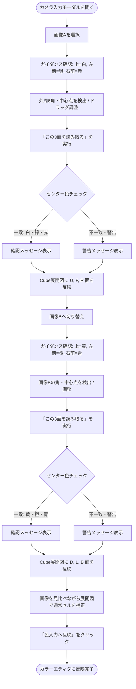

# 2方向キューブ画像入力機能 仕様書

本ドキュメントは、Cube Studio における「2方向の画像からキューブの色設定を行う機能（Camera Input / Two-View Input）」の仕様、設計方針、および再検討に向けた詳細事項をまとめた仕様書です。

---

## 1. 概要と目的

### 1.1 目的
実物の 3×3×3 ルービックキューブを正面から1面ずつ（計6回）入力する手間を削減し、**対角2方向から撮影した2枚の画像（各3面、計6面）**からキューブの全ステッカー（54マス）の状態を一括認識し、色設定を可能にする。

### 1.2 コアコンセプト
- **3面同時キャプチャ**: 1枚の画像からアイソメトリック風に見える3つの面（上面・前面左・前面右）を一括して幾何変換・サンプリング。
- **入力ガイダンスの明示**: ユーザーが迷わず正しい向きで撮影できるよう、画像A・画像Bの撮影向き（上面・左手前・右手前のセンター色と角度）を画面上で明示。
- **センターセルの色チェック**: 画像処理時（キャプチャ時）に各面のセンターセル色を検証し、期待される標準配置との整合性を判定・フィードバック。
- **画像と Cube 展開図の同時表示・補正**: 読み取り処理後に撮影画像とキューブ展開図（6面十字配置）を並べて同時に表示。ユーザーは画像を見比べながら展開図上で直感的に確認・補正できる。
- **センター固定原則**: ルービックキューブの基本性質に基づき、センターセルは編集不可（固定）とし、センターセル以外のセル（エッジ・コーナー）のみ編集可能。
- **クライアント完結**: 画像は外部サーバーへ送信せず、ブラウザ内（HTML Canvas API / JavaScript）で完全にプライベートに処理。

---

## 2. 撮影・入力方式とガイダンス仕様

### 2.1 2枚の画像（View A / View B）の定義と撮影ガイダンス

ユーザーインターフェース（モーダル上部およびヘルプエリア）に以下の撮影手順ガイダンスを明示する。

> [!IMPORTANT]
> - **画像Aの撮影**: 白面を上、緑面を左手前、赤面を右手前にして斜め上45度から撮影。
> - **画像Bの撮影**: 黄面を上、橙面を左手前、青面を右手前にして斜め上45度から撮影（画像Aの反対側）。

| 画像 | 視点 | 期待されるセンター色 | 幾何配置（画像内頂点: 左上, 右上, 右下, 左下） |
| :--- | :--- | :--- | :--- |
| **画像A (View A)** | 第1対角視点（U / R / F） | **上面**: 白 (`U`)<br>**右手前（前面右）**: 赤 (`R`)<br>**左手前（前面左）**: 緑 (`F`) | 上面 (U): $[P_1, P_2, \text{Center}, P_6]$<br>前面右 (R): $[\text{Center}, P_2, P_3, P_4]$<br>前面左 (F): $[P_6, \text{Center}, P_4, P_5]$ |
| **画像B (View B)** | 第2対角視点（D / L / B） | **上面**: 黄 (`D`)<br>**左手前（前面左）**: 橙 (`L`)<br>**右手前（前面右）**: 青 (`B`) | 上面 (D): $[P_6, P_1, P_2, \text{Center}]$<br>前面左 (L): $[P_4, P_5, P_6, \text{Center}]$<br>前面右 (B): $[P_3, P_4, \text{Center}, P_2]$ |

> [!NOTE]
> 各クアッド領域の頂点列はパースペクティブ補間（`sampleFace`）の基準となる「$[TopLeft, TopRight, BottomRight, BottomLeft]$」の幾何的順序で定義されています。画像内では対角三面投影の幾何形状を共有しますが、各面が展開図の標準座標系（上・下・左・右のUV向き）と一致するよう、展開図の向きに合わせた頂点巡回順序でマッピングされます（例: 画像Aの上面Uは奥の $P_1$ が TopLeft、画像Bの下面Dは天地反転して $P_6$ が TopLeft）。

---

## 3. 画像処理とセンター色チェック仕様

### 3.1 外形検出と幾何サンプリング
1. **外周6点 ($P_1 \sim P_6$) および中心点 ($\text{Center}$)**:
   - 放射状走査（`detectCubeOutline`）によりキューブ外周の6角を自動検出。
   - 3本の対角線の交点平均から中心点を算出。
   - キャンバス上で各頂点・中心点ハンドルをドラッグして微調整可能。
2. **パースペクティブ補間サンプリング (`sampleFace`)**:
   - 3つの各クアッド領域（上面、前面左、前面右）を 3×3 グリッドに分割し、中心付近の画素値を抽出。
   - 基準パレット（U, R, F, D, L, B, ?）との色距離判定により 9 マスの色文字列を取得。
     - **現行実装**: RGB 空間のユークリッド距離で色一致判定（[`web/image-sampler.ts`](file:///Users/katoy/github/study-rust/rust-r-cube/3x3-web-2/web/image-sampler.ts) 参照）。
     - **照明・色空間耐性の向上（今後の拡張方針）**: 知覚的色差（$L^*a^*b^*$ / HSV）や局所キャリブレーションによる改善を検討中。詳細は `docs/color-matching-improvement.md`（作成予定）を参照。

### 3.2 処理時のセンターセル色チェック
「この3面を読み取る」実行時に、各面の中央セル（インデックス 4）の色を検証する。

1. **チェックロジック（As-Is）**:

   現行実装では、サンプリングした各面のセンターセル色（インデックス 4）を認識し、**認識されたセンター色に基づいて動的に面を振り分け**ている（[`web/camera.ts` L495–531](file:///Users/katoy/github/study-rust/rust-r-cube/3x3-web-2/web/camera.ts#L495-L531)）。
   センター色が `?`（未認識）または重複した場合は `defaultFace`（画像A: U/R/F、画像B: D/L/B）へフォールバックする。
   センター色不一致の警告表示は**未実装**。

   - **画像A処理時の期待センター色（確認対象）**:
     - 上面センター = 白 (`U`)
     - 右手前センター = 赤 (`R`)
     - 左手前センター = 緑 (`F`)
   - **画像B処理時の期待センター色（確認対象）**:
     - 上面センター = 黄 (`D`)
     - 前面左センター = 橙 (`L`)
     - 前面右センター = 青 (`B`)

2. **判定・割当ポリシーとフィードバック**:

   > [!IMPORTANT]
   > **以下の「センター固定マッピング」および「警告表示」は To-Be 設計方針であり、現時点では未実装です。**  
   > 実装の際は [`web/camera.ts`](file:///Users/katoy/github/study-rust/rust-r-cube/3x3-web-2/web/camera.ts) の `capture()` メソッドを修正し、対応する E2E テストを追加してください。

   - **センター固定原則と面の決定 `[TODO: 未実装]`**:
     - ルービックキューブの基本性質に従い、展開図上の面配置（U/L/F/R/B/D）およびセンターセル色は不変・固定とする。
     - サンプリング結果は、センター色の認識成否にかかわらず、**各画像本来の割り当て先（画像A: U/R/F / 画像B: D/L/B）へ固定マッピング**される。センターの認識結果によって勝手に他面へ振り分けることはせず、キューブの幾何構造の破綻を防ぐ。
     > [!NOTE]
     > **現行実装（As-Is）との差異と移行理由**:
     > 現行実装では認識されたセンター色による動的振り分けを行っているため、照明等の影響でセンター色が誤判定された場合に別面へ誤割当され、後続画像の入力と重複・破綻する問題があります。本仕様（固定マッピング＋不一致時の警告表示）への移行により、幾何構造の堅牢性を担保します。
   - **正常一致 `[TODO: 未実装]`**:
     - 「画像[A/B]のセンター色（[色名]）を確認しました。」を表示。
     - サンプリング結果を該当面の初期認識値として反映。
   - **不一致・未認識 `[TODO: 未実装]`**:
     - 期待色と異なる場合（例: 上面が黄などキューブの向き違い、または光飛びや陰による未検出 `?`）:
     - 画面上のステータス領域に「⚠️ センター色チェック: 一部のセンター色が期待（画像A: 上面=白、右手前=赤、左手前=緑）と異なります。キューブの向きを確認してください。」を警告表示。
     - 読み取られたステッカー色（エッジ・コーナー）はそのまま各面に反映されるが、センター色は固定値が維持される。ユーザーは右カラムの展開図を見ながら、必要に応じてセルの色修正や撮影のやり直しを行う。

---

## 4. 画像と Cube 展開図の同時表示および編集仕様

### 4.1 2カラム同時表示レイアウト (Camera Workspace)

> [!IMPORTANT]
> **本節（§4.1）は To-Be 設計仕様（実装予定）です。現時点では未実装です。**  
> 実装するには [`web/view.ts`](file:///Users/katoy/github/study-rust/rust-r-cube/3x3-web-2/web/view.ts) のモーダル HTML・[`web/style.css`](file:///Users/katoy/github/study-rust/rust-r-cube/3x3-web-2/web/style.css) の両方を変更する必要があります。

#### 4.1.0 現行レイアウト（As-Is）

現在のモーダル（`#camera-editor`）は以下の構成：

- **上段**: 画像A/B ドロップゾーン（`#camera-drop-a` / `#camera-drop-b`）＋ ビュー切り替えタブ
- **中段**: 検出キャンバス（`#camera-canvas`）＋ ヘルプテキスト（`#camera-help`）＋「この3面を読み取る」ボタン
- **下段**: 読み取り結果カード一覧（`#camera-result-faces`）＋ 補正パレット（`#camera-palette`）

展開図コンテナ（`#camera-net`）は未実装であり、センターチェック警告表示も存在しない。

#### 4.1.1 To-Be レイアウト（実装予定） `[TODO: 未実装]`

読み取り処理時および処理後、モーダル内で**撮影画像（左）**と**キューブ展開図（右）**を横並び（デスクトップ時）で同時に表示する。

```
+-------------------------------------------------------------------------------+
| SCAN YOUR CUBE - 2方向の画像から入力                                        [X] |
+-------------------------------------------------------------------------------+
| [入力ガイダンス]                                                                |
|  ・画像Aの撮影: 白面を上、赤面を右手前、緑面を左手前にして斜め上45度から撮影。     |
|  ・画像Bの撮影: 黄面を上、橙面を左手前、青面を右手前にして斜め上45度から撮影      |
+-------------------------------------------------------------------------------+
| [画像A (白・赤・緑)] [画像B (黄・橙・青)]   [画像Aを表示] [画像Bを表示]         |
+---------------------------------------+---------------------------------------+
| 【左カラム: 撮影画像・検出キャンバス】  | 【右カラム: キューブ展開図・補正】      |
|                                       | [パレット: 白 赤 緑 黄 橙 青 未入力]   |
|            P1 (白面)                  |                                       |
|           /  \                        |               +-------+               |
|      P6  /    \  P2                   |               |   U   | (白)           |
|        |\ Center /| (赤面)             |       +-------+-------+-------+-------+
| (緑面) | \    / |                     |       |   L   |   F   |   R   |   B   |
|        |  \  /  |                     |       | (橙)  | (緑)  | (赤)  | (青)  |
|      P5 \  \/  / P3                   |       +-------+-------+-------+-------+
|          \    /                       |               |   D   | (黄)           |
|            P4                         |               +-------+               |
|                                       |                                       |
| [角を自動検出] [角をクリア]            | [センターチェック結果メッセージ]       |
| [ この3面を読み取る ]                 | [各セル（センター除く）をクリック補正] |
+---------------------------------------+---------------------------------------+
| 進捗: 6 / 6 面完了                                       [色入力へ反映 ->]     |
+-------------------------------------------------------------------------------+
```

#### 4.1.2 レスポンシブ・モバイル対応仕様 `[TODO: 未実装]`
- **ブレークポイント**: 幅 768px 未満（スマートフォン実機等）。
- **配置**: 横並び（2カラム）から縦並び（1カラム上下スタック）へ移行。
  1. 上段: 入力ガイダンスおよび画像・検出キャンバス（必要に応じてピンチズーム・スクロール対応）。
  2. 下段: キューブ展開図および補正パレット・センターチェック通知。
- またはタブ切替方式（「画像・検出」タブ / 「展開図・補正」タブ）により、狭い画面でもキャンバス操作と展開図補正の双方のタッチ領域を十分（各ステッカー最小 40px 四方等）に確保する。

### 4.2 キューブ展開図（Cube Net）での補正仕様
1. **十字型 6面展開図の表示**:
   - 上面(U)、左面(L)、前面(F)、右面(R)、背面(B)、下面(D)を配置。
   - キャプチャ済みの面にはサンプリングされたステッカー色を即座に反映。未キャプチャの面は初期色または未入力(`?`)を表示。
2. **センターセル以外の色編集**:
   - 補正用パレットで色を選択（白・赤・緑・黄・橙・青・未入力）。
   - 展開図上のセルをクリックすることで、任意のエッジ・コーナーの色を変更可能。
   - **各面の中央セル（インデックス 4）は `disabled`（編集不可）**:
     - クリックしても色は変更されない。
     - 二重枠および中央ドット（`•`）により固定セルであることを視覚的に提示。
3. **色入力エディタ（確定画面）への反映**:
   - 6面すべての色が入力完了後、「色入力へ反映」ボタンが有効化。
   - メイン画面のカラーエディタへ状態を引き継ぎ、3Dキューブおよび解法探索へ進む。

---

## 5. UI ステート遷移



---

## 6. 実装コンポーネント一覧

| ファイル | 役割 | 実装・テスト状況（As-Is / To-Be） |
| :--- | :--- | :--- |
| [`web/view.ts`](file:///Users/katoy/github/study-rust/rust-r-cube/3x3-web-2/web/view.ts) | モーダルの HTML 構造（ドロップゾーン、検出キャンバス、結果カード一覧、展開図コンテナ `#camera-net`） | **部分実装（As-Is）**: 現状は上下レイアウトおよびカード一覧コンテナ `#camera-result-faces` を配置。`#camera-net` による左右2カラム十字展開図への刷新は `[TODO: 未実装]`。 |
| [`web/camera.ts`](file:///Users/katoy/github/study-rust/rust-r-cube/3x3-web-2/web/camera.ts) | 外周検出、ドラッグ調整、セル補正（センター固定）、センター色チェック処理、展開図同期レンダリング | **部分実装（As-Is）**: 自動検出・ドラッグ微調整・セル補正・センター固定が稼働中。センター色**固定マッピング**への変更および**不一致警告表示**は `[TODO: 未実装]`。 |
| [`web/style.css`](file:///Users/katoy/github/study-rust/rust-r-cube/3x3-web-2/web/style.css) | 2カラム（画像・展開図同時表示）レスポンシブレイアウト、ガイダンスカード、展開図スタイル | **部分実装（As-Is）**: カード形式の補正スタイルに対応済み。左右2カラムレイアウトおよび十字展開図スタイルへの拡張は `[TODO: 未実装]`。 |
| [`tests/camera-input.spec.ts`](file:///Users/katoy/github/study-rust/rust-r-cube/3x3-web-2/tests/camera-input.spec.ts) | 自動検出、ドラッグ微調整、対角立体認識、セル補正・センター固定の E2E テスト | **実装済み（CI で継続検証）**: 自動検出、ドラッグ微調整、対角立体認識、セル補正・センター固定を検証済み。センター色固定マッピングおよび警告表示に対応するテストは `[TODO: 未実装]`。 |
