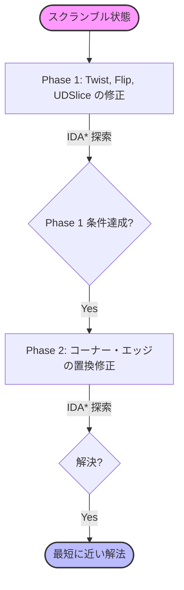

# 3x3 ルービックキューブ

Rustで実装した3x3ルービックキューブのGUIプログラムです。Kociembaの2段階アルゴリズム（Two-Phase Algorithm）を搭載し、どのような状態からでも瞬時に解法を提示します。

[](https://katoy.github.io/rust-r-cube/)


## 特徴

- 🎮 **インタラクティブなGUI**: モダンで直感的な3D/2Dビューインターフェース
- 🚀 **Kociembaアルゴリズム搭載**: 数ミリ秒〜数百ミリ秒で約20手の解法を探索する強力なエンジン
- ⚡ **IDA* 探索の最適化**: 枝刈りテーブルと `Rayon` による並列化を活用した高速処理
- 📊 **リアルタイム進捗表示**: 解法探索中の状況をフェーズごとに可視化
- 📸 **6面スキャン入力**: 実物のルービックキューブの状態を視覚的に入力できる機能
- 💾 **状態の永続化**: ファイルへの保存・読み込み（物理的な向きの自動復元機能付き）
- ✨ **ダイナミックなアニメーション**: 滑らかな回転アニメーションとイージング効果
- 🛡️ **物理的な整合性保証**: コーナー/エッジの物理法則に基づく厳密なパリティチェック

## 必要要件

### デスクトップ版
- Rust 1.75以上

### Web版
- Rust 1.75以上
- wasm32-unknown-unknownターゲット: `rustup target add wasm32-unknown-unknown`
- Trunk: `cargo install trunk`

## ビルドと実行

### デスクトップ版

```bash
# リリースビルド
cargo build --release

# 実行
cargo run --release --bin rubiks-cube-3x3
```

### Web版

**🌐 オンラインデモ:** [https://katoy.github.io/rust-r-cube/](https://katoy.github.io/rust-r-cube/)

**ローカル開発:**

```bash
# 開発サーバーで起動
trunk serve --open

# リリースビルド
trunk build --release
```

## 使い方

### 基本操作

- **スクランブル**: キューブをランダムに20手程度混ぜます
- **リセット**: キューブを初期状態（完成状態）に戻します
- **解法を探す**: 現在の状態から解法を探索します。Kociembaアルゴリズムにより、通常 0.1〜0.5秒程度で解が見つかります。

### 6面スキャン入力

実物のキューブを模したインターフェースで、各面の色を直接指定できます。
全54マスの入力が完了すると、自動的に物理的な整合性（パリティ）がチェックされ、問題なければ操作可能になります。

### 神の数 (God's Number)

3x3x3ルービックキューブは、どのような状態からでも最大 **20手** (HTM基準) で解けることが証明されています。
本ツールのソルバーは、この「神の数」に近い効率的な手順（通常18〜22手程度）を即座に生成します。

## アーキテクチャ

### 探索アルゴリズム（Kociemba Two-Phase）



## ライセンス

MIT License
