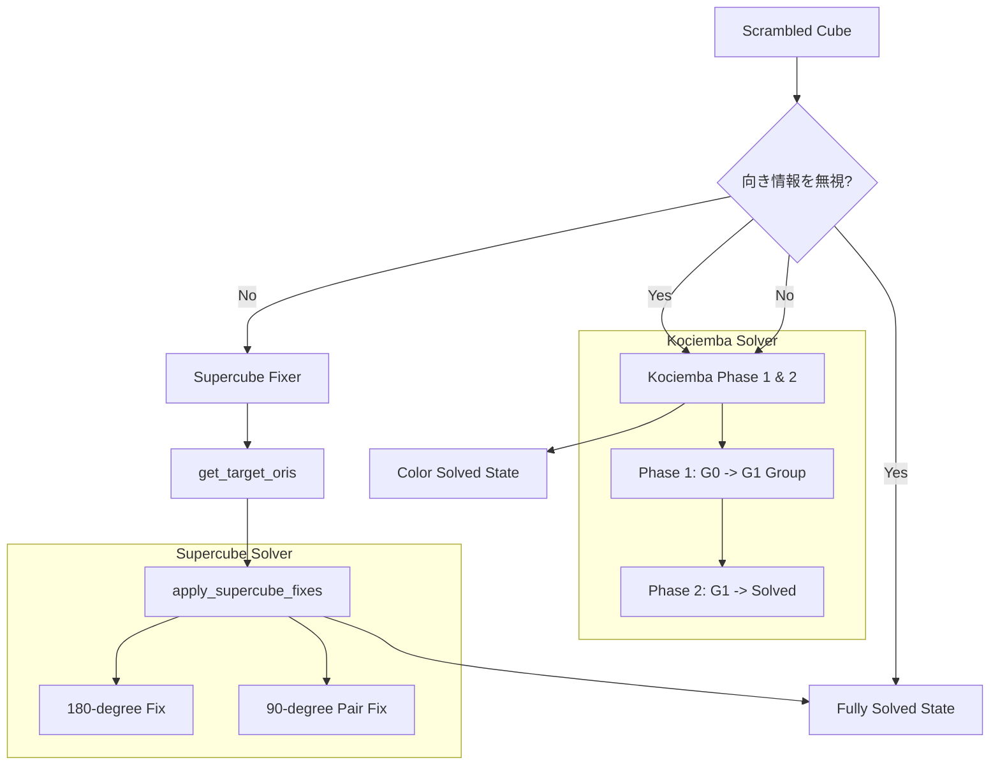
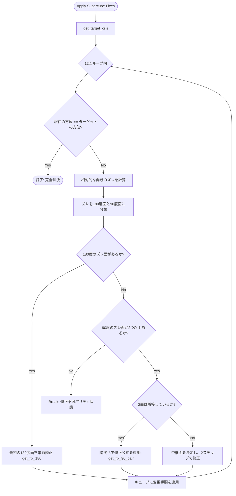

# 3x3 ルービックキューブ・ソルバー技術仕様書
本ドキュメントでは、本プロジェクトにおけるルービックキューブ（およびスーパーキューブ）の探索・解決エンジン（ソルバー）について、**数学的観点**と**プログラム的観点**の両面から詳細に解説します。

---

## 1. ソルバーシステム全体像

本プログラムのソルバーは、以下の2つの核となるモジュールから構成されています。
1. **Kociembaの2段階アルゴリズム (Two-Phase Algorithm)**: 通常の3x3キューブ（色の配置のみ）を高速に解くための探索エンジン。
2. **スーパーキューブ・フィックス・アルゴリズム (Supercube Fixer)**: センターピースの自転（向きのズレ）を、他のピースの配置を一切崩さずに修正するための数学手順適用エンジン。



---

## 2. 数学的観点（群論とアルゴリズム）

### 2.1 ルービックキューブ群 $G$ の定義

ルービックキューブのすべての合法的な状態の集合は、回転操作を二項演算とする有限群（ルービックキューブ群）$G$ を構成します。
通常状態のルービックキューブ群 $G$ の位数（取り得る状態数）は次式で与えられます。

$$|G| = 8! \times 3^7 \times 12! \times 2^{10} \div 2 \approx 4.3252 \times 10^{19}$$

各変数の群論的な意味は以下の通りです。
- $8!$: 8個のコーナーピースの置換数
- $3^7$: 8個 of コーナーピースの向きの自由度（最後の1個の向きは他の7個で一意に決定されるため $3^7$）
- $12!$: 12個のエッジピースの置換数
- $2^{10}$: 12個のエッジピースの向きの自由度（同様に最後の1個は一意に決定されるため $2^{11} \div 2 = 2^{10}$）
- 除数 $2$: 位置の置換（偶置換・奇置換）のパリティ制限

### 2.2 Kociembaの2段階アルゴリズム (Two-Phase Algorithm)

Kociembaのアルゴリズムは、状態空間が巨大な群 $G$ を直接探索するのではなく、適切な中間部分群 $H$ を定義し、探索を2つのフェーズに分割します。

#### 部分群 $H$ (または $G_1$) の定義
部分群 $H$ は、以下の操作によって生成される $G$ の部分群です。

$$H = \langle U, D, R^2, L^2, F^2, B^2 \rangle$$

この部分群 $H$ の特徴は以下の通りです。
1. すべてのコーナーピースの向きが正しい状態（向きのズレが $0$）。
2. すべてのエッジピースの向きが正しい状態（向きのズレが $0$）。
3. 中間層（UD-Slice: FR, FL, BR, BL の4つのエッジ）にあるべきピースが、位置の並び順は別として、中間層の中に収まっている。

#### フェーズ1: $G \to H$ の探索
フェーズ1の目標は、任意のスクランブル状態から、操作 $\langle U, D, R, L, F, B \rangle$ を用いて、部分群 $H$ に属する状態へ遷移させることです。
この探索で用いる座標（状態空間の決定変数）は以下の3つです。
- **Corner Orientation ($CO$)**: $3^7 = 2,187$ 通り
- **Edge Orientation ($EO$)**: $2^{11} = 2,048$ 通り
- **UD-Slice Positions ($Slice$割合)**: $\binom{12}{4} = 495$ 通り

探索空間の大きさは次式で表されます。

$$\Omega_1 = 2,187 \times 2,048 \times 495 = 2,217,093,120 \approx 2.22 \times 10^9$$

これは元の状態空間に比べて圧倒的に小さく、メモリ上に枝刈りテーブル（Pruning Tables）を構築することで、PCやブラウザ環境でも瞬時に最短手数を計算可能です。

#### フェーズ2: $H \to \text{Solved}$ の探索
フェーズ2では、すでに部分群 $H$ に属している状態から、部分群 $H$ 内の操作（$U, D, R^2, L^2, F^2, B^2$）のみを用いて、完全解決状態（Solved）を目指します。
この探索で用いる座標は以下の3つです。
- **Corner Permutation ($CP$)**: $8! = 40,320$ 通り
- **Edge Permutation (UD層の8エッジ, $EP8$)**: $8! = 40,320$ 通り
- **UD-Slice Permutation (中間層の4エッジの並び順, $EP4$)**: $4! = 24$ 通り

探索空間の大きさはパリティ制限（置換が偶置換でなければならない）を考慮すると次のようになります。

$$\Omega_2 = 40,320 \times 40,320 \times 24 \div 2 \approx 1.95 \times 10^{10}$$

### 2.3 スーパーキューブの数学と方位パリティ (Orientation Parity)

スーパーキューブ $\bar{G}$ では、6つのセンターピースが固有の向きを持ち、それぞれ $90^\circ, 180^\circ, 270^\circ, 0^\circ$（計4状態）を独立して取ることができます。これにより、状態空間は通常の $G$ に比してさらに拡大します。

#### スーパーキューブ群 $\bar{G}$ の位数
$$\left|\bar{G}\right| = |G| \times 4^6 \div 2 = |G| \times 2048 \approx 8.8579 \times 10^{22}$$

ここで除数 $2$ が現れる理由は、**センター方位パリティ制限**が存在するためです。
キューブの物理構造上、エッジやコーナーの置換パリティ（Permutation Parity）と、センターの自転角度のパリティは連動しています。
外見上の色の配置が揃っている解決状態（Color Solved）において、各センターの自転量を $\text{ori}_i \in \{0, 1, 2, 3\}$ （$i \in \{1..6\}$, $1$は $90^\circ$ 時計回り）と表すと、次のパリティ制約式が数学的に成り立ちます。

$$\sum_{i=1}^6 \text{ori}_i \equiv 0 \pmod 2$$

すなわち、**$90^\circ$ 回転している面（奇数回転面）の個数は必ず偶数個**でなければならず、単独で $90^\circ$ だけ自転しているセンターピースは物理的に存在し得ません。ただし、単独で $180^\circ$ 自転しているセンター（$\text{ori}_i = 2$）は、総和が $2 \equiv 0 \pmod 2$ となるため、単独存在が許容されます。

#### センター向き修正公式（色保存的操作）
センターの向きのみを回転させ、他のエッジやコーナーの位置・向きを完全に保存する操作群（Commutators）を適用します。

| 修正タイプ | 対象面 | 適用公式例 (全パーツ色保存) |
| :--- | :--- | :--- |
| **単独 $180^\circ$ 修正** | $U$ 面 | $(U \cdot R \cdot L \cdot U^2 \cdot R' \cdot L' \cdot U \cdot R \cdot L \cdot U^2 \cdot R' \cdot L')$ |
| **ペア $90^\circ$ 修正** | $U$ 面 (CW) & $R$ 面 (CCW) | $(M' \cdot E \cdot M \cdot U \cdot M' \cdot E' \cdot M \cdot U')$ |

---

## 3. プログラム的観点（Rust実装と最適化）

### 3.1 探索アルゴリズムの並行処理アーキテクチャ

本プログラムでは、探索速度の極大化とUX（ユーザー体験）の向上のため、**並列計算（Rayon）**と**協調的マルチタスク（WASM非同期化）**を両立させています。

```
                    [ 探索開始 ]
                         │
        ┌────────────────┼────────────────┐
   (X軸回転開始)    (Y軸回転開始)    (Z軸回転開始)  (回転なし開始)
        │                │                │                │
     [Thread 1]       [Thread 2]       [Thread 3]       [Thread 4]
        │                │                │                │
     IDA*探索         IDA*探索         IDA*探索         IDA*探索
        │                │                │                │
        └────────────────┼────────────────┘
                         │ (最初に見つかったスレッドが他をキャンセル)
                         ▼
                  [ 解法を結合・返却 ]
```

- **スレッド並列探索**:
  ルービックキューブは全体を $X, Y, Z$ 軸方向に回転させた状態で探索を開始しても同一の解（回転記号を逆変換したもの）が得られます。`solver/mod.rs` 内の並列探索では、キューブを回転させた異なる初期状態（計4通り）を `rayon::spawn` を用いて並列に探索し、最初に見つかった解決手順を採用します。
- **WASM協調探索 (`SolverState`)**:
  シングルスレッドで動くブラウザ（WASM環境）では、長時間の同期探索は画面をフリーズさせます。そのため、ソルバーの探索スタックや進捗率を構造体 `SolverState` にカプセル化し、JavaScript側から `process_chunk(limit)` を介して一定の探索ノード数ごとに細切れに実行できるように設計しています。

### 3.2 枝刈りテーブル (Pruning Tables) の構造とメモリレイアウト

探索の高速化のために、目標状態からの距離を保持した巨大な配列（枝刈りテーブル）をコンパイル時、または遅延ロード時に生成します。

```rust
pub struct PruningTable {
    pub twist_slice: Vec<u8>, // [2187 * 495] = 1,082,565 bytes (約1.0MB)
    pub flip_slice: Vec<u8>,  // [2048 * 495] = 1,013,760 bytes (約1.0MB)
    pub cp_slice: Vec<u8>,    // [40320 * 24]  = 967,680 bytes   (約0.9MB)
    pub ep8_slice: Vec<u8>,   // [40320 * 24]  = 967,680 bytes   (約0.9MB)
}
```

各テーブルには、目標状態からの距離がバイト単位（`u8`）で格納されます。
探索時の `depth` と照合し、`distance > remaining_depth` である場合はその先への探索を即座にカット（枝刈り）します。
この配列はグローバルな遅延初期化 `LazyLock`（Rust標準ライブラリ）に格納され、スレッド間で完全に共有されるため、メモリフットプリントは最小限（合計で約4MB）に抑えられます。

### 3.3 物理的不整合の検証（エラーハンドリング仕様）

入力されたステッカーの色配置が、物理的に組み立て可能な状態であるかをKociembaアルゴリズムへの入力前に厳密にチェックします。
`cube/validation.rs` で実装されている検証の数学的条件は以下の通りです。

```
              [ 6面スキャン入力 ]
                       │
                       ▼
             1. 色数カウントチェック (各色9枚?)
                       │
                       ▼
             2. エッジパリティチェック (反転エッジが偶数個?)
                       │
                       ▼
             3. コーナーパリティチェック (ねじれ総和が3の倍数?)
                       │
                       ▼
             4. 置換パリティチェック (位置交換の偶奇が一致?)
                       │
                       ▼
                [ Kociembaソルバーへ ]
```

1. **色数カウントチェック**:
   U, D, L, R, F, Bの各色のステッカー数が厳密に **9枚ずつ** であることを確認します。
2. **エッジ反転パリティ (Edge Flip Parity)**:
   反転したエッジ（正しい向きから $180^\circ$ ズレているエッジ）の総数は、必ず **偶数個** でなければなりません。奇数個である場合、エラーコードを返します。
3. **コーナーねじれパリティ (Corner Twist Parity)**:
   各コーナーのねじれ量を時計回りに $1$, 反時計回りに $2$, 正位を $0$ としたとき、全8個のコーナーねじれ量の総和は必ず **3の倍数** にならなければなりません。

   $$\sum_{i=1}^8 \text{twist}_i \equiv 0 \pmod 3$$

4. **置換パリティ (Permutation Parity)**:
   エッジピースの置換サイン（符号）と、コーナーピースの置換サインは必ず一致しなければなりません。片方だけが奇置換（奇数回のスワップ状態）であるキューブは組み立て不可能です。

---

## 4. プログラム構造とデータフロー

### 4.1 主要モジュール構成

- **[`cube/mod.rs`](file:///Users/katoy/github/study-rust/rust-r-cube/3x3-web/src/cube/mod.rs)**: キューブの物理状態表現。ステッカーの配列からピース指向表現（Cubie形式）への相互変換を担当。
- **[`kociemba/mod.rs`](file:///Users/katoy/github/study-rust/rust-r-cube/3x3-web/src/kociemba/mod.rs)**: 二段階アルゴリズムの核心部。テーブルの生成と深度探索。
- **[`solver/mod.rs`](file:///Users/katoy/github/study-rust/rust-r-cube/3x3-web/src/solver/mod.rs)**: 色解決ソルバーの統括とWASM/並列探索の連携インターフェース。
- **[`solver/fix.rs`](file:///Users/katoy/github/study-rust/rust-r-cube/3x3-web/src/solver/fix.rs)**: センター向き修正公式の選定と適用。

### 4.2 センター向き修正のアルゴリズムフロー (`solver/fix.rs`)

以下は、色解決完了後にセンターの向きを特定・修正する際の実際のプログラムロジックの流れです。



この修復プロセスは最大12回（すべての面が $180^\circ$ 回転している場合など、1面ずつ修正しても高々数ステップ）で必ず収束します。パリティ制限に引っかかった場合はループを `break` し、安全に処理を終了します。
